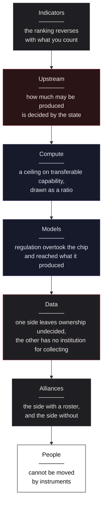
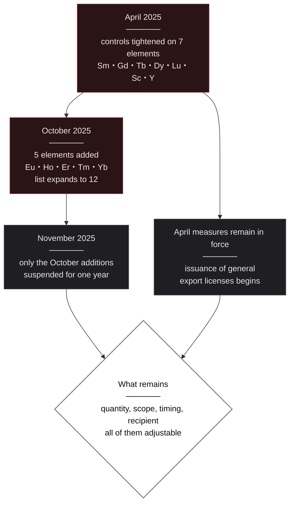
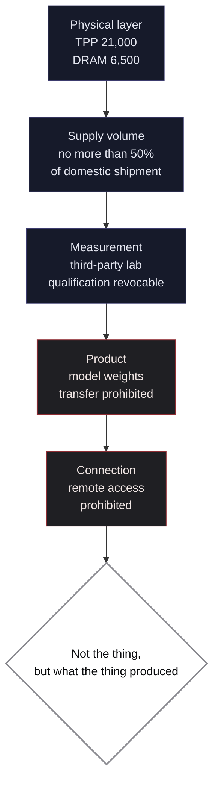
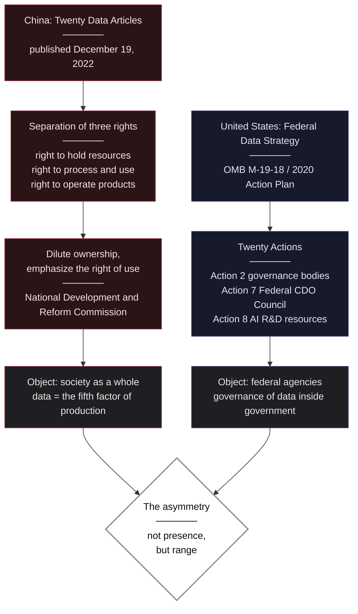
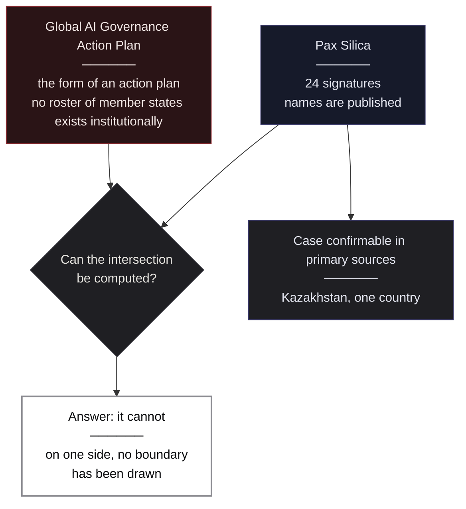
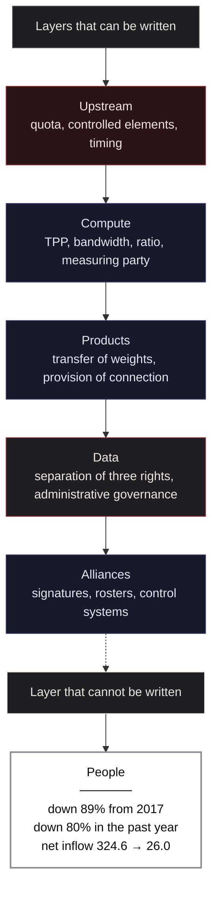

# US-China AI Competition ── The Layers of US-China AI Competition

> **"The numbers say who is winning. The documents say who decides."**  
> （数字は、誰が勝っているかを語る。文書は、誰が決めているかを語る）

 

---

# Prologue: Three Reversals Inside One Report

Three numbers, placed side by side without commentary.

**74.24%.** 
China's share of the 131,121 AI patents granted worldwide in 2024. The United States held 12.06%. 
In absolute terms, 97,990 for China against 15,920 for the United States — a gap of roughly six times.

**51.91%.** 
The share of forward citations — how often those AI patents were cited by other patents. 
The United States holds 51.91%, China 29.81%. This time the United States leads by a factor of 1.7.

**14.31.** 
The figure for the country that ranks first in AI patents granted per 100,000 population. 
That country is neither the United States nor China. It is **South Korea**. 
Luxembourg follows at 12.25. China stands at 6.95 and the United States at 4.68 — neither near the top.

These three were not gathered from separate studies. 
All of them appear in **the same Chapter 1** of the AI Index Report published by Stanford HAI in 2026. 
The same institution, in the same year, drawing on the same database (EPO PATSTAT Global).

**Within a single indicator called "patents," changing how you count reverses the ranking three times.**

"Who is winning the US-China AI race?" — the question is asked everywhere. 
But once those three numbers are lined up, it becomes clear that the question itself has broken. 
Count by volume and it is China; count by influence and it is the United States; count per capita and it is South Korea. 
None of these is manipulated data. All of them appear in the same report.

This book does not answer that question. 
**Instead of judging which side is stronger, it describes who decides what, in each layer.**

Why take that approach? 
When indicators diverge, arguing about victory conceals a prior choice: which indicator to adopt. 
Whoever chooses grant counts arrives at Chinese superiority; whoever chooses citations arrives at American superiority. 
**The conclusion is already contained in the selection of the metric.**

Yet something does not diverge even when indicators do. 
Instruments. 
The rule issued by the Bureau of Industry and Security of the U.S. Department of Commerce, effective January 15, 2026, states in figures the performance ceiling for semiconductors exportable to China and Macau. 
The document published by China's State Council in December 2022 sets out an institutional design that splits data rights into three. 
The statistics of the U.S. Geological Survey list China's rare-earth production at 270,000 tons. 
And a footnote states that **this is not output but a production quota**.

These leave little room for interpretation. The conclusion does not change with who did the counting. 
**This book reads instruments, not indicators.**

## The Layers This Book Covers, and the Ones It Does Not

This book divides the AI competition not into a single contest but into multiple layers.

The descent runs from indicators through upstream, compute, models, data, and alliances, down to people. 
Only the last layer is filled in white. **That is where the boundary lies between what can be written into instruments and what cannot.**

The layers this book does not cover should also be stated. 
National shares of semiconductor manufacturing equipment. 
The composition of semiconductor materials supply. 
National breakdowns of rare-earth refining capacity. 
Holdings of standard-essential patents specific to the AI field. 
Each bears on this book's subject. But **primary sources could not be reached**. 
Either only re-citations of paid market-research reports exist, or no public tabulation under a unified definition exists.

What could not be reached is not written as though it had been. 
What this book does not do is stated at the outset.

## On the Handling of Sources

This book cites U.S. government documents and Chinese government documents at the same depth. 
**Neither, however, is treated as neutral description.**

A U.S. Department of Commerce rule is a statement of how the U.S. side has defined its own security. 
A Chinese State Council document is a statement of how the Chinese side has designed its own data institutions. 
Each is an assessment by a party to the matter — a description of facts and, at the same time, a declaration of position. 
This book places the two side by side, with that character made explicit.

Where a statement rests on reporting, it is marked as reporting. 
Figures whose primary sources could not be reached are not stated at all.

The author has no commercial relationship with any government agency, semiconductor company, or AI lab on either the U.S. or the Chinese side, and receives no funding from either. 
**This book has no position to defend.**

 

---

# Chapter 1: Who Is Winning Depends on What You Count

The three numbers set out in the prologue are not a special case. 
The phenomenon — change the indicator and the ranking changes — occurs everywhere anyone tries to measure the AI competition. 
This chapter shows the full picture.

## What Is Being Counted Was Never Settled

What does the phrase "AI competitiveness" actually refer to? 
Consider the principal indicators.

**Number of models.** 
By Epoch AI's tally, the "notable models" announced in 2025 number 59 for the United States, 35 for China, and 8 for South Korea. Here the United States leads.

This figure comes with a condition, however. 
As the source itself states, this is a **manually curated list**, not an exhaustive survey covering every model released worldwide. 
The judgment of what counts as "notable" is what determines the number.

**Number of papers.** 
Shares of AI-related papers in 2024: China 17.76%, Europe 11.05%, India 7.55%, the United States 7.29%. China holds more than twice the U.S. share.

By citation share, it reads China 20.6%, Europe 19.5%, the United States 12.6%. The ranking holds, but the gap narrows. 
Narrow further to the 100 most-cited papers and a different movement appears. 
The United States fell from 64 in 2021 to 46 in 2024, while China rose from 33 to 41. 
**In total volume the gap is wide; among the top 100, the two are close to even.**

**Open-source activity.** 
Shares of AI projects on GitHub with 10 or more stars: 
United States 31.71%, other 27.63%, Europe 24.47%, China 11.01%, India 5.18%. 
By cumulative stars, the United States holds 30.02M against China's 9.00M — a gap of more than three times.

Here too the source attaches a caveat. 
**Chinese developers use domestic platforms such as Gitee and GitCode.** 
**Measured against GitHub, therefore, China's share appears smaller than it is.** 
The very place of measurement determines the result.

## The Side With More Volume and the Side With More Influence Do Not Coincide

Granting the limits of these indicators, a structure still comes into view.

Set out once more the triple reversal in patents from the prologue.

| Method of counting | Leader | Figures |
| --- | --- | --- |
| Grants (2024) | China | 74.24% (97,990) / United States 12.06% (15,920) |
| Forward-citation share | United States | 51.91% / China 29.81% |
| Grants per 100,000 population | South Korea | 14.31 / Luxembourg 12.25 / China 6.95 / United States 4.68 |

The same thing occurs with papers. In total volume China holds more than twice the U.S. share; among the 100 most-cited, the two are close to even. 
**The side with more volume and the side with more influence do not coincide.**

This is not a value judgment. 
Grant counts are a number produced by systems of application and examination; forward citations are a number expressing how far other research has referred to a given patent. 
**They measure different things.** The former measures activity, the latter influence. 
Nothing in the data licenses calling either one the "true" measure of strength.

## Change the Denominator and a Non-Participant Takes the Lead

That South Korea leads on a per-100,000-population basis is not a mere footnote.

It shows that **framing this question as a bilateral matter is itself a choice.** 
Count in absolute terms and the country of 1.4 billion and the country of 300 million rise to the top. 
Count per capita and South Korea, Luxembourg, and Switzerland come up. 
Neither method is wrong. 
But which one is adopted changes the very frame of whose competition this is.

The same structure recurs in the talent layer. 
As of 2025, AI authors and inventors number 220,520 in the United States, 50,460 in India, and 48,520 in Germany — an overwhelming U.S. lead. 
Yet per 100,000 population, Switzerland at 110.45 and Singapore at 109.51 take the lead, with the United States at 64.84.

Chapter 7 returns to this point. 
Here it is enough to confirm that **the structure by which the choice of denominator determines the ranking appears in patents and in talent alike.**

## Which Is Why Stacking Indicators Yields No Answer

One conclusion follows from all of the above.

The intuition that adding more indicators improves accuracy does not hold in this domain. 
Model counts, paper counts, patent grants, citations, GitHub stars, per-capita figures — each returns a different ranking. 
One could synthesize them all into a single composite ranking, but the weights assigned in doing so are **a judgment by the compiler, not a measurement.**

What, then, should one look at?

This book's answer is not indicators but **instruments**. 
Which side is stronger changes with the method of counting. 
But **how China altered the elements subject to export controls in April and again in October**, 
and **the figures at which the United States drew the line for semiconductors bound for China**, 
do not change with the method of counting. They are written in documents.

From the next chapter, this book reads those instruments. 
The first descent is into the layer that looks farthest from AI and is in fact the most upstream.

### References

1. Stanford University Human-Centered Artificial Intelligence (HAI), "2026 AI Index Report, Chapter 1: Research and Development" (2026) 
   <https://hai.stanford.edu/ai-index/2026-ai-index-report/research-and-development>
2. Stanford HAI, "AI Index Report 2026" (AI patent data compiled from EPO PATSTAT Global; notable models from Epoch AI; talent data from Zeki Data) 
   <https://hai.stanford.edu/ai-index/2026-ai-index-report>
3. U.S. Geological Survey, "Mineral Commodity Summaries 2026: Rare Earths" (China 2025 output 270,000 tons; footnote 14 states this is a production quota) 
   <https://pubs.usgs.gov/periodicals/mcs2026/mcs2026-rare-earths.pdf>
4. Bureau of Industry and Security, U.S. Department of Commerce, "Revision to License Review Policy for Advanced Computing Commodities," Federal Register Vol.91 No.10, pp.1684-1689 (effective January 15, 2026; FR Doc 2026-00789) 
   <https://www.govinfo.gov/content/pkg/FR-2026-01-15/html/2026-00789.htm>
5. State Council of the People's Republic of China, "Opinions of the CPC Central Committee and the State Council on Building Basic Data Systems to Better Leverage the Role of Data Elements" (published December 19, 2022) 
   <https://www.gov.cn/zhengce/202212/content_6720768.htm>

 

---

# Chapter 2: How Much May Be Produced Is Decided by the State

Begin at the place that looks farthest from AI. 
Underground.

## The Figure of 69% of the World

Take rare-earth mine production from the "Mineral Commodity Summaries" published by the U.S. Geological Survey (USGS) in 2026. 
Units are metric tons of rare-earth oxide equivalent.

| Country | 2024 | 2025 |
| --- | --- | --- |
| **China** | 270,000 | **270,000** |
| United States | 45,500 | 51,000 |
| Australia | 29,000 | 29,000 |
| Burma | 27,000 | 22,000 |
| Thailand | 2,100 | 4,800 |
| Vietnam | 300 | 150 |
| **World total** | 380,000 | **390,000** |

Of the 2025 world total of 390,000 tons, China accounts for 270,000. 
That is 69.2%. The gap to the second-place United States at 51,000 tons is more than fivefold, and every other country is an order of magnitude smaller.

This figure is cited without fail whenever Chinese dominance in rare earths is discussed. 
But something most articles quoting this table never mention sits on the same page.

## Reading Footnote 14

The USGS attaches a footnote to China's figure. 
It states that these 270,000 tons are **a production quota rather than output**, and that they **do not include unreported production**.

The difference is decisive. 
The 51,000 tons for the United States is a "reported" value — the amount actually produced and reported. 
Australia's 29,000 tons is likewise an estimate of production. 
But China's 270,000 tons is **not what was extracted. It is the amount the state decided may be produced.**

This is not a fine point. 
A figure accounting for 69% of world rare-earth production is **an administrative decision wearing the face of a measurement.** 
Whether actual extraction exceeds the quota or falls short of it, what appears in the statistics is the quota. 
The USGS publishes it knowing this, and says so in the footnote.

The proposition "China holds seventy percent of the world" is correct. 
But that seventy percent exists not as a result of geology but as **an administrative allocation.**

## Who Receives It, and When, Are Also Decided

If only the quantity were decided, this would be one more form of resource policy. 
But in 2025 China used the same framework to move **who receives it and when** as well.

Follow the chronology as the USGS has organized it on the U.S. record.

**April 2025.** 
Samarium, gadolinium, terbium, dysprosium, lutetium, scandium, yttrium — 
export controls were tightened on seven elements, covering alloys, compounds, metals, and oxides.

**October 2025.** 
Five more elements were added: europium, holmium, erbium, thulium, ytterbium. 
The controlled list expanded to twelve elements.

**November 2025.** 
The measures covering the five elements added in October were **suspended for one year.**

**The April measures were not suspended.** 
Controls on the seven elements remained in force, and in their place the **issuance of general export licenses** began for selected exporters.

These four stages, set out in one figure.

What was suspended was only the October addition. 
The controls as a whole were neither relaxed nor withdrawn. 
**Which elements, until when, and against whom** are each being operated individually.

## Not Relaxation, but Resolution

Read this movement as "relaxation brought about by progress in US-China dialogue" and the structure is misread.

Relaxation would lift the controls across a surface. 
That is not what happened. 
Of twelve elements, five were halted for one year. The remaining seven were left in place. 
And alongside that, a separate channel was opened — **a general license through which only selected firms may pass.**

Choose what to halt, delimit for how long, designate who may pass. 
**The controls are coming to operate at a finer grain.**

And nowhere in these four stages does any physical or economic factor appear — no increase in extractable reserves, no fall in demand. 
What moves is administrative judgment alone.

As confirmed in Chapter 1, the indicators of AI competition change their ranking with the method of counting. 
But what happens in this layer is not a question of counting. 
It is a fact recorded in documents: **a figure accounting for 69% of the world is an administrative allocation, and the recipients and timing of that allocation are being operated one by one.**

## What Is Decided Upstream Becomes Invisible Downstream

Rare earths may not look like a story about AI. 
But what is decided in this layer appears in none of the layers below it.

Neither the metrics of semiconductor performance, nor model benchmarks, nor data-center capacity show "to whom, and on what terms, permission to release the material was granted." 
Conditions are written upstream; downstream, only the results are observed as numbers.

**The proliferation of indicators seen in Chapter 1 sits downstream of this structure.** 
The ranking changes whatever you count because everything being counted sits beneath conditions written upstream.

How finely, then, are those conditions written? 
The next chapter reads instruments that placed a ceiling not on quantity but **on capability itself.**

### References

1. U.S. Geological Survey, "Mineral Commodity Summaries 2026: Rare Earths" (world production, country breakdown, footnote 14 on China's figure, and the 2025 export-control chronology) 
   <https://pubs.usgs.gov/periodicals/mcs2026/mcs2026-rare-earths.pdf>

 

---

# Chapter 3: A Ceiling on Transferable Capability, Drawn as a Ratio

What the previous chapter read was a mechanism deciding the "quantity" that may be released. 
What this chapter reads is a mechanism deciding the "capability" that may be transferred.

## On January 15, 2026, the Premise of Review Changed

A final rule published by the Bureau of Industry and Security (BIS) of the U.S. Department of Commerce took effect on January 15, 2026. 
Federal Register Vol.91 No.10, pp.1684-1689. Document number FR Doc 2026-00789, Docket 260112-0028, RIN 0694-AK43.

What this rule changed was the premise of review itself. 
Its scope is certain advanced semiconductors bound for China and Macau. 
The license review policy shifted from the prior **presumption of denial** to **case-by-case** review.

It is a change that reads as "the controls have been relaxed." 
But read the instrument and something is written there that the word relaxation cannot hold.

## What Qualifies as "Transferable"

The products eligible for case-by-case review are delimited by performance.

**TPP (Total Processing Performance) under 21,000**, and **total DRAM bandwidth under 6,500 GB/s.** 
The definition of TPP sits in Technical Note 2 to 3A090.a/b of the Export Administration Regulations. 
The instrument names as its examples the **NVIDIA H200 or AMD MI325X.**

The ceiling on what may be transferred is thus fixed by two figures. 
Compute performance, and memory bandwidth. Only products falling below both enter the arena of individual review.

Up to this point, it can be understood as a control drawing a performance ceiling. 
But the instrument contains one further criterion, separate from performance.

## The Ceiling Was Drawn as a Ratio, Not a Unit Count

Read the condition at (dd)(1)(iii) of the rule.

The **aggregate TPP** of advanced-node integrated circuits exported to China and Macau must be **no more than 50% of the aggregate TPP shipped to U.S. customers for U.S. domestic end use** for the same product.

**This is not a unit count.** 
It is not a ceiling on how many may be sold. It is a structure in which **the total compute performance that may be supplied to China is determined in lockstep with how much has been supplied domestically in the United States.**

Consider what this design produces. 
If domestic U.S. shipments rise, the amount that may go to China rises. If domestic shipments fall, the amount that may go to China falls. 
**The ceiling for China is set not by circumstances on the Chinese side but by supply performance on the U.S. side.**

The standard of the control lies outside the party being controlled.

## Who Measures Is Also Decided by the Instrument

Having set numerical standards in TPP and DRAM bandwidth, the rule raises the question of who measures those numbers. 
Paragraph (dd)(3) prescribes the measuring party as well.

The requirements are several. 
* The testing laboratory must be **headquartered in the United States.**
* It must **not be under the control of capital from a D:5 group country or Macau.**
* **Testing must be conducted within the U.S. customs territory.**
* It must hold no equity or financial interest in any party to the transaction.
* It must be able to draw a representative sample from the shipment batch.
* And before export, it must submit to BIS a certificate verifying the performance specifications.

Further, the rule states this. 
BIS may revoke a testing laboratory's qualification at any time, for any reason.  
Upon revocation, case-by-case treatment ceases for any exporter relying on that laboratory.

This single sentence carries considerable weight. 
The performance ceiling is published as figures. But the qualification to measure those figures can be revoked by the administration at will. 
**The standard is public; the authority to apply the standard is reserved.**

It has the same shape as the rare-earth structure seen in the previous chapter. 
There, the ceiling on quantity is public, but to whom and when it is released is operated case by case. 
Here, the ceiling on performance is public, but who may measure it can be revoked at any time.

## Where Presumption of Denial Was Left in Place

The shift to case-by-case was not applied to everything.

For exports to companies **headquartered or parented in Macau or a D:5 group country, the presumption of denial is maintained.** 
In addition, eight countries are enumerated as subject to remote end-user declaration: Belarus, China, Cuba, Iran, Macau, North Korea, Russia, and Venezuela.

A shift in review policy and the maintenance of presumption of denial coexist within the same rule. 
**What moved was the performance classification of products, not the classification of covered parties.**

## What Is Happening on the Countable Side

What the instrument delimits is compute performance and memory bandwidth. 
The scale of the reality to which that instrument applies is worth confirming.

By Stanford HAI's tally, the power capacity of AI data centers reached **roughly 29.6GW as of Q4 2025.** 
Given that New York State's peak demand is about 31GW, the compute infrastructure for AI alone consumes power comparable to an entire state.

In the number of data centers, the asymmetry is starker still. 
As of 2025: **United States 5,427, Germany 529, United Kingdom 523, China 449.** The United States exceeds second place by more than tenfold. 
This figure counts facilities, however, and does not reflect differences in facility scale, compute capacity, or utilization.

That what is being counted is once again not fully settled is exactly as seen in Chapter 1. 
But the instrument read in this chapter is not a question of counting. 
TPP 21,000, DRAM bandwidth 6,500 GB/s, 50% of domestic shipment — these are figures written in a document, with no room for interpretation.

And this instrument has more to say. 
The object of the controls was not the chip alone.

### References

1. Bureau of Industry and Security, U.S. Department of Commerce, "Revision to License Review Policy for Advanced Computing Commodities," Federal Register Vol.91 No.10, pp.1684-1689 (FR Doc 2026-00789 / Docket 260112-0028 / RIN 0694-AK43 / effective January 15, 2026) 
   <https://www.govinfo.gov/content/pkg/FR-2026-01-15/html/2026-00789.htm>
2. Stanford University Human-Centered Artificial Intelligence (HAI), "2026 AI Index Report, Chapter 1: Research and Development" (AI data-center power capacity 29.6GW; country breakdown of data-center counts, compiled from Cloudscene for counts and the IEA for power) 
   <https://hai.stanford.edu/ai-index/2026-ai-index-report/research-and-development>

 

---

# Chapter 4: Regulation Overtook the Chip and Reached the Model

The rule read in the previous chapter contains provisions separate from the performance ceiling. 
Those two provisions are presented first, without interpretation.

## Provision (vii)(2) ── Model Weights Shall Not Be Transferred

This is the content of (dd)(1)(vii)(2).

An IaaS (Infrastructure as a Service) provider **shall not transfer model weights trained on the AI commodity in question to an end user not disclosed on the license.** 
It cannot be done without BIS approval.

The provision leaves no room for interpretation. 
What is controlled is not the transfer of the chip. 
It is the transfer of **what was trained on that chip.**

## Provision (vii)(3) ── Access to Trained Algorithms Shall Not Be Provided Either

The following provision, (dd)(1)(vii)(3), goes further.

**Remote access to algorithms trained** on the AI commodity in question **shall not be provided, directly or indirectly**, to any party falling under (dd)(1)(iv).

The declaration covers the eight countries seen in the previous chapter. 
Belarus, China, Cuba, Iran, Macau, North Korea, Russia, Venezuela. 
Companies headquartered or parented in these are included as well.

## The Object of Control Moved From the Thing to What the Thing Produced

What did these two provisions change?

Export control is by origin an institution that binds the crossing of borders by things. 
What may be carried where. To whom it may be sold. 
Its object was always a thing that physically moves.

But what (vii)(2) and (vii)(3) bind is not a thing. 
It is **weights, which are data**, and **access, which is a state.** 
The chip stays in a data center inside the United States and does not move an inch. 
What moves is only the set of numbers that chip produced, and the right to touch them.

**Regulation overtook the chip and reached what the chip produced.**

Place these two provisions alongside the instruments of the previous chapter and the structure resolves.

The upper three layers bind things and quantities. 
In the lower two, the object of binding itself changes.

## The Layer Regulation Reached Is Closing on Its Own

Consider here a movement separate from regulation.

By Stanford HAI's tally, of the **102 notable models announced in 2025, the largest group — 47 — were provided by API access only.** 
API-only release has risen consistently since 2020.

On training code, the picture is clearer still. 
**Of the 102, 81 keep their training code closed.** 
Only **four** were released as open source.

As of 2020, open and closed stood at roughly equal numbers. 
In five years, that ratio inverted.

And it is not only one camp that is closing. 
The source states it by name. 
Resource-intensive models including those of OpenAI, Anthropic, and Google **disclose none of the following: training code, parameter counts, dataset size, or training duration.**

Regulation prohibited "the transfer of weights" and "access to trained algorithms." 
In the same period, on the market side, weights, training code, and parameter counts have simply stopped being published at all.

## The Two Movements Point the Same Way

Causation cannot be asserted here. 
Whether regulation drove the closing, whether the closing came first and regulation caught up, or whether the two proceed independently — this book does not hold the data required to decide.

What can be confirmed is only the fact that **the directions coincide.** 
On the side of instruments, the transfer of products and the provision of connection were prohibited. 
On the side of the market, publication of those products itself declined. 
Reachability is narrowing from both law and commercial practice.

This structure has been described from another angle as well. 
*Frontier-Grade Open Weights*, by the same author as this book, treats the problem from a different direction. 
Open-weight models reached frontier-grade performance. 
But not everyone can reach them. 
Holding 2.8 trillion parameters of weights, running them across 64 or more accelerators, verifying them independently — the actors capable of that are few. 
**It is published, yet unreachable.** 
**That book names this condition "Privileged Open."** 
**And it argues that what moved was not ownership of the model but the location of scarcity.**

What that book treated were the constraints imposed by physics and by markets. 
What this chapter has read is **the same unreachability, written by a state as an instrument.**

> 📘 **The Frontier Was Opened. But It Was Never Made Open.** 
> Have frontier-grade open-weight models actually been opened? 
> <https://github.com/Leading-AI-IO/frontier-grade-open-weights>

## To Which Layer Have the Terms Been Written?

A ceiling was drawn on physical performance, supply volume was bound as a ratio, the measuring party was designated, the transfer of products was prohibited, and even the provision of connection was prohibited.

**From the chip to what the chip produced, the terms are written continuously.**

What, then, of the stage before that — the material from which models are trained? 
The next chapter reads the data institutions of both countries. 
What appears there is not opposition but **a difference in what each institution takes as its object.**

### References

1. Bureau of Industry and Security, U.S. Department of Commerce, "Revision to License Review Policy for Advanced Computing Commodities," Federal Register Vol.91 No.10, pp.1684-1689 ((dd)(1)(vii)(2) / (dd)(1)(vii)(3) / (dd)(1)(iv) / effective January 15, 2026) 
   <https://www.govinfo.gov/content/pkg/FR-2026-01-15/html/2026-00789.htm>
2. Stanford University Human-Centered Artificial Intelligence (HAI), "2026 AI Index Report, Chapter 1: Research and Development" (access types and training-code disclosure for the 102 notable models of 2025) 
   <https://hai.stanford.edu/ai-index/2026-ai-index-report/research-and-development>
3. Satoshi Yamauchi, "Frontier-Grade Open Weights," Leading.AI (2026) 
   <https://github.com/Leading-AI-IO/frontier-grade-open-weights>

 

---

# Chapter 5: China Left Ownership Undecided; the United States Has No Institution for Collecting

There is a contrast invoked more often than any other when data is discussed. 
China's state manages data centrally; the United States leaves it to the private sector.

Read the primary documents of both countries and this contrast does not hold.

## China Chose Not to Fix Ownership at All

There is a document published jointly by China's State Council and the Central Committee of the Communist Party of China. 
Its formal title is "Opinions of the CPC Central Committee and the State Council on Building Basic Data Systems to Better Leverage the Role of Data Elements." 
It is commonly called the **"Twenty Data Articles."** 
It was published through Xinhua on December 19, 2022, having passed review at the 26th meeting of the Central Comprehensively Deepening Reforms Commission on June 22 of the same year.

At the center of this document is the **separation of three rights.** 
Rights concerning data are divided into three.

* **The right to hold data resources**
* **The right to process and use data**
* **The right to operate data products**

What deserves attention is that "ownership" is not among the three. 
In its official commentary, the National Development and Reform Commission states the aim of this design as follows.

**"Dilute ownership; emphasize the right of use."**

That is to say: without answering the question of who owns the data, the design **stipulates who may do what at each of three junctures — holding, processing and use, and productization.** 
Disputes over ownership are avoided, and circulation is made to work first.

The same document positions data as **the "fifth factor of production,"** after land, labor, capital, and technology. 
To be a factor of production is to be an object traded in markets.

Summarize this as "centralized state management" and the substance of the design disappears. 
What China institutionalized is **not state ownership of data, but the circulation of use without fixing ownership.**

It has been reported that, under this system, companies became able to carry data resources on their balance sheets. 
China's Ministry of Finance is said to have permitted, in 2023, the recognition of qualifying data resources as intangible assets or inventory. 
However, **the original text from the Ministry of Finance could not be reached**, so this book treats it as a statement resting on reporting and states neither company counts nor amounts.

## The United States Does Have a National Data Strategy

Look at the other side of the contrast.

There is a claim that "the United States has no national data strategy equivalent to China's Twenty Data Articles." 
This is contrary to fact.

The **Federal Data Strategy** exists. 
Its framework was set out in M-19-18 (June 2019) of the Office of Management and Budget (OMB), which prescribes forty practices. 
On that basis a **2020 Action Plan** was published, listing **twenty Actions** as concrete implementation items.

The principal ones include the following.

* **Action 1** — Identify data needs to answer priority questions
* **Action 2** — Establish diverse Data Governance Bodies
* **Action 7** — **Launch the Federal Chief Data Officer Council**
* **Action 8** — **Improve data and model resources for AI research and development**

Data preparation for AI research and development is explicitly included, as Action 8. 
The statement that it "does not exist" cannot stand.

## The Asymmetry Lies Not in Presence but in Object

Are the two countries' institutions the same, then? 
No. But what differs is not whether they exist.

What the Federal Data Strategy takes as its object is **the governance of data held and used by federal agencies.** 
Which department holds which data, how it is managed, published, and shared. The object lies inside government.

What the Twenty Data Articles take as their object is **an institutional foundation for circulating society-wide data as a factor of production.** 
Data held by companies, public data, the rights attaching to them, and the mechanics of trade. The object extends outside government.

**The difference is not the presence of an institution, but the range it reaches.**

This difference, set out in one figure.

## The Asymmetry in Where Data Is Born

That the institutions differ in range is a separate question from how much data is actually born. 
In one layer, a clear asymmetry is observed.

By the tally of the International Federation of Robotics (IFR), new installations of industrial robots in 2024 numbered 542,000 worldwide, with an operational stock of 4,664,000. 
Of these, **China installed 295,000** — 54% of the world. Its operational stock reaches 2,027,200.
Japan installed 44,500 and the United States 34,200, each less than one-sixth of China.

Further, the domestic share held by Chinese domestic suppliers has risen **from about 28% to 57%.** 
China is both the side installing and, increasingly, the side supplying.

Industrial robots are frequently cited as a data source for AI that operates in the physical world. 
However, **no independent study comparing the volume or quality of that data across countries could be reached.** 
The asymmetry in unit counts can be confirmed; the grounds for deriving an asymmetry in capability from it are not in this book's hands.

What cannot be derived is not derived.

## The Same Problem of Integration, Solved by Different Actors

Even where the range of institutions differs, the technical problem the two countries face is the same. 
The problem of integrating dispersed data into a form usable for decisions.

There is a case in the United States where this problem was solved as a commercial product. 
*The Palantir Impact*, by the same author as this book, treats the ontology of Palantir Foundry. 
Two of the core principles that book extracts bear directly on this point.

**Integration of nouns and verbs** —  
Not only objects (states) such as customers and parts, but also actions (motions) such as placing orders and changing status, are contained within a single model. 
**Governance of the real world** —  
Against the power to rewrite real operations, control is exercised through branching and review.

The United States realized this as **a commercial product.** 
China, through the separation of three rights in the Twenty Data Articles, is attempting to design it as **a state institution.**

**The same problem, solved by different actors.**

> 📘 **The Palantir Impact: Ontology Strategy Connecting Data and AI** 
> The "ontology" strategy that connects data and AI 
> <https://github.com/Leading-AI-IO/palantir-ontology-strategy>

Institutions close within a country. 
But the competition to write the terms goes beyond borders. 
The next chapter looks at how each country binds other nations to it. 
There, **it cannot be counted at all.**

### References

1. State Council of the People's Republic of China, "Opinions of the CPC Central Committee and the State Council on Building Basic Data Systems to Better Leverage the Role of Data Elements" (published December 19, 2022; passed at the 26th meeting of the Central Comprehensively Deepening Reforms Commission, June 22, 2022) 
   <https://www.gov.cn/zhengce/202212/content_6720768.htm>
2. National Development and Reform Commission, "Interpretation of the Opinions on Building Basic Data Systems to Better Leverage the Role of Data Elements" (separation of three rights; "dilute ownership, emphasize the right of use") 
   <https://www.ndrc.gov.cn/>
3. Federal Data Strategy, "2020 Action Plan," U.S. Federal Government (twenty Actions; Action 7 Federal CDO Council; Action 8 data and model resources for AI R&D) 
   <https://strategy.data.gov/2020/action-plan/>
4. Office of Management and Budget, "M-19-18: Federal Data Strategy — A Framework for Consistency" (June 2019) 
   <https://strategy.data.gov/>
5. International Federation of Robotics, "World Robotics 2025" (2024: 542,000 new installations worldwide / operational stock 4,664,000 / China 295,000, 54%) 
   <https://ifr.org/>
6. Satoshi Yamauchi, "The Palantir Impact: Ontology Strategy Connecting Data and AI," Leading.AI (2026) 
   <https://github.com/Leading-AI-IO/palantir-ontology-strategy>

 

---

# Chapter 6: The Side With a Roster, and the Side Without

"Which camp will you join, the United States or China?" — the question has become a fixture in discussions of AI diplomacy in 2026. 
This chapter shows why the question cannot be answered.

Not for want of information. **Because the institutional forms differ.**

## The U.S. Side Has a Roster

Among the frameworks led by the U.S. Department of State is **Pax Silica.** 
It was launched in December 2025 under Under Secretary for Economic Affairs Jacob Helberg. 
The second summit was held in Washington, D.C. on June 25–26, 2026.

Pax Silica has **24** signatures. 
The breakdown published by the State Department is as follows.

New signatories at the second summit (**10**) 
Argentina / Chile / Costa Rica / El Salvador / the EU / Germany / Greece / Kazakhstan / the Netherlands / Panama

> This figure of 24 requires care as well. Among the ten new signatories stand four entries: the EU, Germany, Greece, and the Netherlands. The EU is a supranational body with 27 member states, and Germany, the Netherlands, and Greece are among them. Three member states signed individually; the remaining 24 did not. Whether the EU's signature extends to those states cannot be determined from the State Department's published text.

There is a roster. But the units listed on it are not uniform. 
The problem of "what is being counted," seen in Chapter 1, has entered even the figure that looks most definite of all — a count of signatures.

Existing signatories (**14**) 
Australia / Finland / India / Israel / Japan / Norway / Qatar / South Korea / Singapore / Sweden / the Philippines / the UAE / the United Kingdom / the United States

Taiwan has expressed support for the principles through a separate joint statement.

The names are published. The count is fixed. 
**It can be treated as a set.**

## And There Is Another Roster

A fact easily confused here should be settled.

Separate from Pax Silica, there exists a document called the **Joint Statement on AI Opportunity.** 
Its signatures number the United States plus 34 countries, **35** in total. The State Department describes this as "close to three dozen."

**Pax Silica's 24 signatures and the AI Opportunity Statement's 35 signatures are different documents and different sets.** 
Conflate the two and both figures lose their meaning.

What the framework actually does is also written in the documents. 
The **Pax Silica Artificial Intelligence Assistance Project** is an initiative directed at Panama. 
It is to develop a platform tracking credentials and provenance across the AI supply chain, integrated with existing customs, port, and transport tracking systems. 
It is to begin with a pilot involving Panama's port and customs authorities.

**The signatures do not stop at declaration; they connect to a system of logistical control.**

## The Chinese Side Has No Roster

The framework led by China is the **"Global AI Governance Action Plan."** 
It is a document published by China's Ministry of Foreign Affairs on July 26, 2025.

But this is not an organization holding a roster of member states. 
**It takes the form of an action plan, and a list of member states does not institutionally exist.**

Countries expressing support have been reported. But there is no mechanism by which one signs and one's name is published. 
What constitutes participation. From when. What happens on withdrawal. No mechanism defines these.

## Which Is Why the Question Has No Answer

From all of the above, one consequence follows.

**The question "how many countries participate in both the U.S. and Chinese camps" has no institutional answer.**

Set A has a roster. Set B does not. 
An intersection with a set that has no roster cannot be computed. 
It is not that the inquiry was insufficient. On one side, no boundary has been drawn in the first place.

Only one case can be confirmed in primary sources. 
**Kazakhstan** appears by name on the State Department's published list as a Pax Silica signatory — a participant from Central Asia. 
There are reports that it is also engaged with the Chinese framework, but **so long as the Chinese side has no roster, that cannot be established from primary sources.**

## What Has Been Reported

On August 14, 2026, Reuters reported on a draft letter from the U.S. State Department. 
It is said to have included a policy under which the 35 signatories of the AI Opportunity Statement would not be permitted dual membership with the Chinese framework. 
The State Department declined to comment on what was described as a leaked internal document, the report states.

This book **records it as reporting only.** 
Since the State Department has not confirmed the content, it is not used in this chapter's conclusion.

## That It Cannot Be Counted Is Itself a Structure

Chapter 1 showed that the ranking changes with the method of counting. 
What this chapter has shown is that **it cannot be counted at all.**

The former was a problem of measurement. The latter is a problem of the institution itself. 
One side chose the form of a roster; the other chose the form of an action plan. 
That choice itself expresses each side's diplomatic design. 
A roster buys a clear boundary at the cost of raising the bar to participation. 
Having no roster buys breadth of participation at the cost of an ambiguous boundary.

**The choice of form is itself the strategy.**

The descent so far has run through upstream, compute, products, data, and alliances. 
In every layer, someone was writing the terms.

Finally, look at the layer where they cannot be written.

### References

1. U.S. Department of State, "Outcomes of the Second Pax Silica Summit" (24 signatories / June 25–26, 2026 / Pax Silica AI Assistance Project) 
   <https://www.state.gov/>
2. U.S. Department of State, "Joint Statement on AI Opportunity" (United States plus 34 countries = 35 signatures) 
   <https://www.state.gov/ai-opportunity-statement>
3. Ministry of Foreign Affairs of the People's Republic of China, "Global AI Governance Action Plan" (published July 26, 2025) 
   <https://www.fmprc.gov.cn/>
4. Reuters, "U.S. State Department draft letter: signatories to AI framework not to be permitted dual participation with Chinese framework" (August 14, 2026; the State Department declined to comment)

 

---

# Chapter 7: What Is Moving Is Neither Resources nor Regulation, but People

Six layers have been descended so far. 
In every one, someone was writing the terms. Quantity, performance, ratio, measuring party, transfer, connection, rights, roster.

In the last layer, that structure breaks down.

## Inflows to the United States Fell by Ninety Percent

Take one figure from Stanford HAI's tally.

**AI researchers and developers moving to the United States are down 89% from 2017.** 
And **down 80% in the past year alone.**

Place the two figures side by side and the shape of the decline appears. 
There is a long-run decline of 89%, and the greater part of it is concentrated in the past year. 
This was not a gradual erosion.

## Look at Net Inflow and the Ranking Inverts

Compare countries by net inflow — arrivals minus departures.

| Country | Net inflow, 2025 |
| --- | --- |
| United States | **+26.0** (peak of 324.6 in 2022) |
| Germany | -2.4 |
| Canada | -7.1 |
| **India** | **-16.9** (largest net outflow) |

The United States remains positive. 
But **from 324.6 in 2022 to 26.0 in 2025**, it has fallen to roughly one-twelfth in three years.

India, at -16.9, is the largest net exporter of talent. 
As seen in Chapter 1, India holds third place worldwide in AI paper share (7.55%) and second worldwide in AI authors and inventors (50,460). 
**It is a country that produces and, at the same time, loses.**

## Here Too, Change the Denominator and the Ranking Changes

The structure confirmed in Chapter 1 recurs in the talent layer.

In absolute numbers, the United States is overwhelming. 
AI authors and inventors: United States 220,520, India 50,460, Germany 48,520. 
The United States holds more than four times second place.

But per 100,000 population, the ranking reverses. 
**Switzerland at 110.45 and Singapore at 109.51** take the lead, with the United States at **64.84** and Germany at 58.10.

It is the same structure seen with patents. 
Count by volume and large states come out on top. Count by density and small states do. 
Both are correct, and which one is adopted changes the answer to "who is strong."

## The Layers That Can Be Written, and the One That Cannot

Here, the structure of the whole book appears.

In the six layers up to the previous chapter, the party writing the terms could be identified. 
It is China's administration that sets the rare-earth production quota. 
It is the U.S. Department of Commerce that sets the TPP ceiling. 
It is China's State Council that divides data rights into three. 
It is the U.S. Department of State that publishes the Pax Silica signatories.

But **which country an AI researcher moves to cannot be decided by an instrument.**

The United States sits at the center of the side writing the terms. 
It writes the performance ceiling for chips, writes the ratio for supply volume, designates the measuring party, prohibits the transfer of model weights, and publishes the roster of its camp.

And in that same United States, inflows have fallen to 89% below 2017, and 80% below the level of a year ago.

## The Line Between Company and State Cannot Be Drawn by Technology

There is one more thing that resists being written into instruments. 
The boundary between company and state.

Export control classifies its objects by party. 
As seen in Chapter 3, a presumption of denial is maintained for companies headquartered or parented in a D:5 group country or Macau. 
For that classification to work, **it must be institutionally possible to define which company belongs to which state.**

A master's thesis addressing this problem exists at the University of Oxford. 
Kot, C.H.B. (2025), *Dual-Use Security Dilemma and the U.S.-China AI Technology Race*. 
It was awarded the university's Sara Norton Prize.

Its subject is the distinguishability of dual-use technology. 
Whether a given technology is for military or civilian use, and whether that can be told apart. 
The thesis **does not explain this from the properties of the technology itself.** 
It explains it from the relationship of subordination between state and private enterprise, and the degree of military-civil integration — **from the structure of political economy.**

For the same technology, distinguishability changes when the relationship between company and state differs. 
**No line is drawn on the side of the technology. The line is on the side of institutions.**

This point bears on the premises of the instruments this book has read. 
The classification "a company headquartered in a D:5 group country" functions because parties can be divided by a legal form — the location of a head office. 
But that form does not necessarily coincide with actual relationships of control.

## What the Last Layer Shows

In the competition to write the terms, two things could not be written.

**The movement of people**, and **the substantive relationship between company and state.** 
The former crosses borders freely, however one tries to write it. 
For the latter, the premise required for writing lies not in technology but in institutions, and those institutions differ by country.

And these two are moving the most.

The side writing the terms can control a great deal. 
But **what can be controlled and what decides the outcome are not necessarily the same.**

### References

1. Stanford University Human-Centered Artificial Intelligence (HAI), "2026 AI Index Report, Chapter 1: Research and Development" (inflows to the United States down 89% from 2017 and 80% in the past year; net inflow by country; AI authors and inventors and per-100,000 figures. Talent data compiled from Zeki Data) 
   <https://hai.stanford.edu/ai-index/2026-ai-index-report/research-and-development>
2. Kot, C.H.B., "Dual-Use Security Dilemma and the U.S.-China AI Technology Race," MPhil Thesis, University of Oxford (2025; awarded the Sara Norton Prize) 
   <https://ora.ox.ac.uk/>

 

---

# Final Chapter: The Side That Writes the Terms

## Seven Layers Saying One Thing

This book has read the AI competition by dividing it into seven layers. 
What was confirmed in each layer, set out on a single sheet.

| Layer | Party writing the terms | Content of the terms | Primary source |
| --- | --- | --- | --- |
| **Indicators** | Compiling institutions | What is counted. What is taken as the denominator | Stanford HAI, "2026 AI Index," Chapter 1 |
| **Upstream** | China's administration | How much may be released (quota of 270,000 tons) / controlled elements / suspension periods / which firms may pass | USGS, "MCS 2026: Rare Earths" |
| **Compute** | U.S. Department of Commerce, BIS | TPP under 21,000 / DRAM bandwidth under 6,500 GB/s / no more than 50% of domestic shipment / designation of the measuring party, revocable at any time | FR Doc 2026-00789 |
| **Products** | U.S. Department of Commerce, BIS | Prohibition on transferring trained model weights / prohibition on providing remote access to trained algorithms | Ibid. (dd)(1)(vii)(2)(3) |
| **Data** | China's State Council / U.S. OMB | Separation of three rights (dilute ownership, emphasize the right of use) / twenty Actions for federal agency data governance | Twenty Data Articles / Federal Data Strategy |
| **Alliances** | U.S. Department of State / China's Ministry of Foreign Affairs | A roster of 24 signatures and a control system / an action plan with no roster | Pax Silica / Global AI Governance Action Plan |
| **People** | **None** | Cannot be written into instruments | Stanford HAI / Kot (2025) |

Six layers have a party writing the terms. 
The last one does not.

And comparing the content of the terms, it becomes clear that **both countries are doing the same kind of thing.** 
China decides how much may be released, and decides to whom and when. 
The United States decides what capability may be transferred, decides who measures it, and decides how it may be used after transfer. 
The means differ. The direction is the same.

**Both are writing the terms under which the other must work.**

## Three Anticipated Objections

### Objection 1: This is not competition but interdependence

Advanced AI chips are manufactured almost entirely by TSMC in Taiwan. 
Principal HBM manufacturing is handled by SK hynix and Samsung (South Korea) and Micron (United States). 
Packaging is handled by ASE Group (Taiwan) and Amkor (United States). 
Neither the United States nor China can complete a single chip on its own.

**This objection is correct.** 
And this book's account does not contradict it. 
It is precisely because interdependence exists that writing the terms carries meaning. 
If complete separation were possible, there would be no need to write terms for the other side to work under. 
It is because the other cannot be cut loose that how much to hand over is written into instruments.

The 50% rule read in Chapter 3 is the clearest case. 
A design in which the ceiling for China is linked to domestic supply performance in the United States **cannot function unless both are presumed to sit inside the same supply chain.**

### Objection 2: Instruments may be written, but they are not enforced

In January 2025, the United States introduced the AI Diffusion Rule. 
But on May 12 of the same year, the Department of Commerce announced its intent to rescind it and made clear it would not be enforced. 
It is a case of a written rule disappearing without ever being applied.

**This objection is also correct.**  
That an instrument is written and that it takes effect are different matters. 
The January 15, 2026 rule this book has read may likewise be rescinded in future.

Yet this fact itself lends support to the book's proposition in one respect. 
Writing a rule and rescinding it are both done by the same party. 
**The authority to write and the authority to nullify what was written are held by the same side.**  
That a rule goes unenforced indicates the breadth of discretion held by the side writing the terms.

### Objection 3: The frame of "a competition to write the terms" is itself unverified

This book is written on the premise that the design of terms shapes the outcome of competition. 
But that premise has not been verified.

**No study quantitatively verifying, at the industry level, a causal path from the volume of data to AI capability could be confirmed in this book's research.**  
The same holds for studies measuring the effect of centralized state management of data on the speed of AI development. 
Three research engines independently reported this gap, and this book's own additional inquiry did not fill it.

It therefore cannot be asserted that "the side that writes the terms wins." 
What this book has shown is **the fact that both countries are committing institutional resources to writing the terms** — not a proof that this determines the outcome.

As Chapter 7 showed, the layer that is moving most has no terms written for it. 
**This objection points precisely at the place this book does not reach.**

## What the Numbers Did Not Say

In the prologue, three numbers were set out. 
74.24%, 51.91%, 14.31. Carried in the same chapter of the same report, measuring the same "patents," and reversing the ranking three times.

This book has not answered that question. 
It has read instruments instead.

* That it is a quota, not output.
* That the ceiling is drawn as a ratio, not a unit count.
* That the qualification of the measuring party can be revoked at any time.
* That regulation overtook the chip and reached the weights.
* A design that circulates the right of use without fixing ownership.
* The form that holds a roster, and the form that does not.

None of these change with the method of counting. They are written in documents.

**The numbers say who is winning. The documents say who decides.**  
And so far as this book has read, **what both countries are committing institutional resources to is the latter.**

## What Remains After Reading

This book was written in August 2026. 
Much of what it states will be updated. 
Rules will be amended, controls suspended, signatories added, statistics rewritten in next year's edition.

But something will not be updated. 
**The disposition to confirm, in documents, who is writing the terms.**

In this domain, numbers travel alone. 
"China holds seventy percent." "The United States relaxed its controls." "Open weights caught the frontier." — 
Each is correct in one aspect, and each changes shape once the footnote is read. 
The conclusion is settled the moment the method of counting is chosen, and that choice never surfaces.

I have no commercial relationship with any government agency, semiconductor company, or AI lab. 
I receive no funding from either side. **That is why I can write this.**

**Follow the numbers, and you can speak of victory and defeat.**  
But without following the documents, you cannot know what changes next. 
And for the layer that is moving most, no one has yet written anything at all.

 
---

## 📝 License

This work is licensed under a [Creative Commons Attribution 4.0 International License](https://creativecommons.org/licenses/by/4.0/). 
© 2026 Satoshi Yamauchi / [Leading AI](https://www.leading-ai.io/) — Licensed under CC BY 4.0
