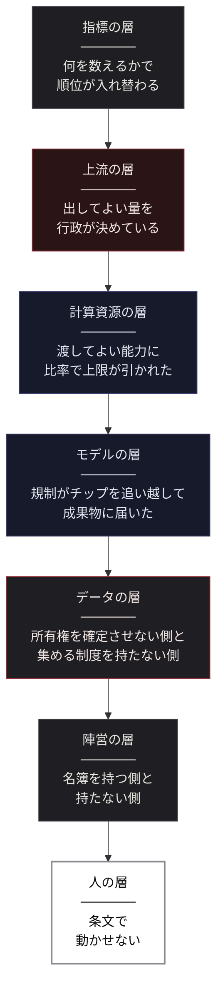
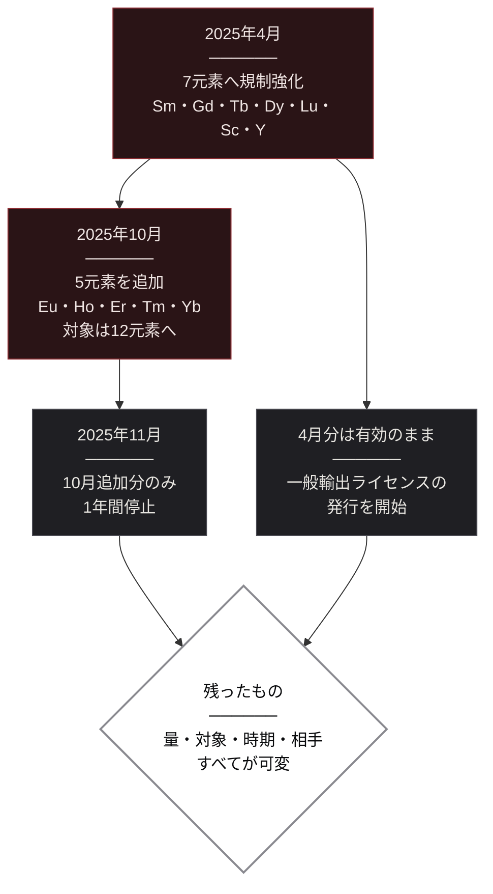
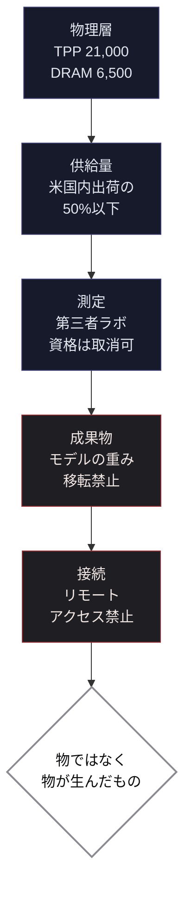
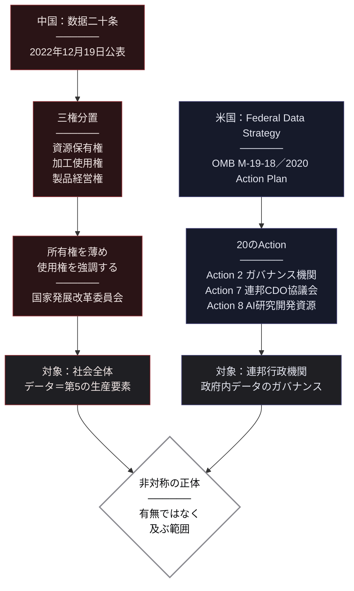
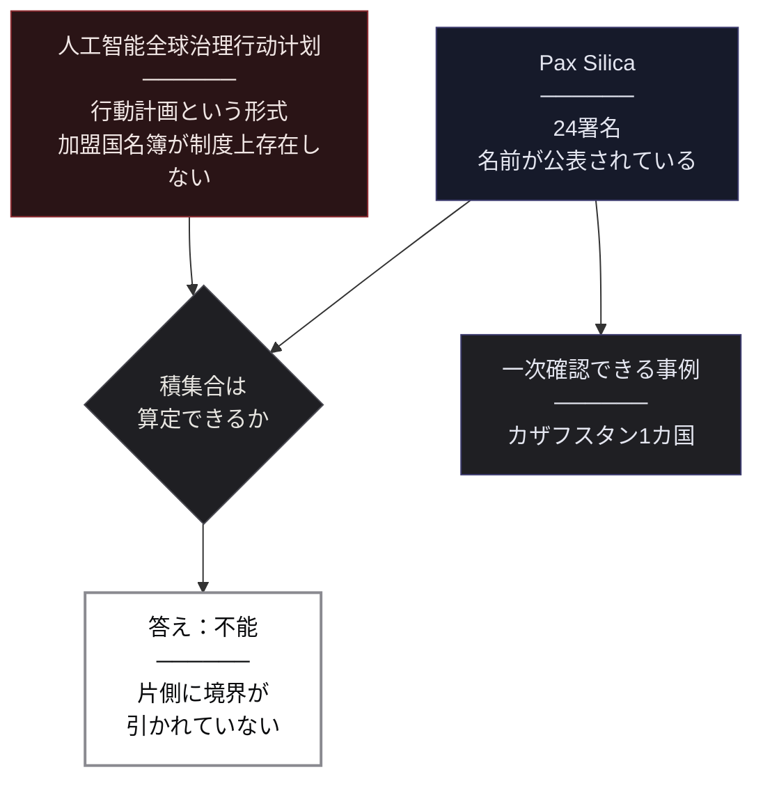
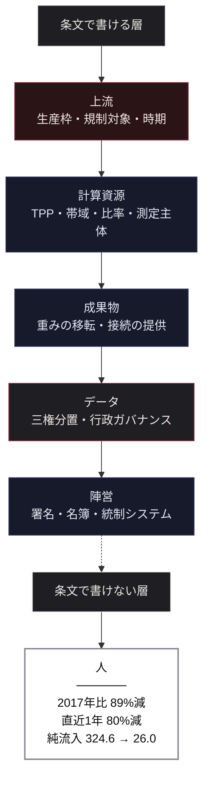

# US-China AI Competition ── 米中AI競争の多層構造

> **"The numbers say who is winning. The documents say who decides."**  
> （数字は、誰が勝っているかを語る。文書は、誰が決めているかを語る）

 

---

# 序章: 同じ報告書の中で、順位が3回入れ替わる

三つの数字を、注釈なしで並べる。

**74.24%。** 
2024年に世界で付与されたAI特許131,121件のうち、中国が占めた割合である。米国は12.06%だった。 
件数にして中国97,990件、米国15,920件。約6倍の開きがある。

**51.91%。** 
そのAI特許が他の特許から引用された回数——前方引用のシェアである。 
米国が51.91%を占め、中国は29.81%だった。今度は米国が1.7倍上回る。

**14.31。** 
人口10万人あたりのAI特許付与件数で首位に立った国の数値である。 
その国は米国でも中国でもない。**韓国**である。 
次いでルクセンブルクの12.25。中国は6.95、米国は4.68で、両国とも上位ではない。

この三つは、別々の調査から拾ってきたものではない。 
すべてスタンフォード大学HAIが2026年に公表した「AI Index Report」の、**同じ第1章に載っている**。 
同じ機関が、同じ年に、同じデータベース（EPO PATSTAT Global）を使って集計した数字である。

**同じ「特許」という一つの指標の中だけで、数え方を変えると三回、順位が入れ替わる。**

「米中AI競争でどちらが勝っているのか」——この問いは、あらゆる場所で発せられている。 
だが上の三つを並べた時点で、問いの形が壊れていることがわかる。 
件数で数えれば中国、影響で数えれば米国、人口比で数えれば韓国。 
どれも操作されたデータではない。どれも同じ報告書に載っている。

本書は、この問いに答えない。 
**どちらが強いかを判定する代わりに、各層で誰が何を決めているのかを記述する。**

なぜそうするのか。 
指標が割れているとき、勝敗を論じることは、「どの指標を採用するか」という選択を隠してしまう。 
件数を選んだ者は中国優位という結論を得て、引用を選んだ者は米国優位という結論を得る。 
**結論は指標の選択の中に、あらかじめ入っている。**

一方で、指標が割れていても割れないものがある。 
条文である。 
2026年1月15日に発効した米国商務省産業安全保障局の規則には、中国・マカオ向けに輸出できる半導体の性能上限が数値で書かれている。 
中国国務院が2022年12月に公表した文書には、データの権利を三つに分ける制度設計が書かれている。 
米国地質調査所の統計には、中国のレアアース生産量が270,000トンと載っている。 
そして脚注に、**これが生産量ではなく生産枠であること**が明記されている。

これらは解釈の余地が小さい。誰が数えたかで結論が変わることもない。 
**本書は、指標ではなく条文を読む。**

## 本書が扱う層と、扱わない層

本書は、AI競争を単一の勝敗としてではなく、複数の層として切り分ける。

上から順に、指標・上流・計算資源・モデル・データ・陣営・人と降りていく。 
最後の層だけが白く塗られている。**条文で書ける層と、書けない層の境目がそこにあるからだ。**

扱わない層も明示しておく。 
半導体製造装置の国別シェア。 
半導体材料の供給構成。 
レアアースの精製能力の国別内訳。 
AI分野に限定した標準必須特許の保有状況。 
いずれも本書の主題に関わる。だが、**一次資料に到達できなかった**。 
市場調査会社の有料レポートを原典とする再引用しか存在しないか、統一された定義の公開集計が存在しないためである。

到達できなかったものを、到達したかのように書かない。 
本書がしていないことを、最初に書いておく。

## 資料の扱いについて

本書は米国政府の文書と中国政府の文書を、同じ深度で引用する。 
ただし、**どちらも中立の記述としては扱わない。**

米国商務省の規則は、米国側が自国の安全保障をどう定義したかの表明である。 
中国国務院の文書は、中国側が自国のデータ制度をどう設計したかの表明である。 
それぞれが当事者の評価であり、事実の記述であると同時に立場の表明でもある。 
本書は両者を、その性質を明示したうえで並置する。

報道に基づく記述には、報道であることを明記する。 
一次資料に到達できなかった数値は、記載しない。

著者は米国・中国いずれの政府機関、半導体企業、AIラボとも取引関係を持たず、いずれの側からも資金提供を受けていない。 
**この本には、守るべき立場がない。**

 

---

# 第1章: どちらが勝っているかは、何を数えるかで決まる

序章で並べた三つの数字は、特殊な事例ではない。 
指標を変えれば順位が変わるという現象は、AI競争を測ろうとするあらゆる場所で起きている。 
本章では、その全体像を示す。

## 数える対象が、そもそも定まっていない

「AI競争力」という言葉は、実際には何を指しているのか。 
主要な指標を挙げる。

**モデルの数。** 
Epoch AIの集計によれば、2025年に発表された「notable model（注目すべきモデル）」は、米国59、中国35、韓国8である。ここでは米国が上回る。

ただし、この数字には条件がある。 
原典自身が明記しているとおり、これは**手動でキュレーションされたリスト**であって、世界中で発表された全モデルを網羅した悉皆調査ではない。 
何を「notable」とするかの判断が、そのまま数字を決めている。

**論文の数。** 
2024年のAI関連論文シェアは、中国17.76%、欧州11.05%、インド7.55%、米国7.29%。中国が米国の2倍以上を占める。

被引用シェアで見ると、中国20.6%、欧州19.5%、米国12.6%。順位は変わらないが、差は縮む。 
さらに被引用上位100論文に絞ると、別の動きが現れる。 
米国は2021年の64本から2024年の46本へ減り、中国は33本から41本へ増えた。 
**論文の総量では大差がつき、上位100本では拮抗している。**

**オープンソースの活動量。** 
GitHub上で10スター以上を獲得したAIプロジェクトのシェアは、 
米国31.71%、その他27.63%、欧州24.47%、中国11.01%、インド5.18%。 
累積スター数では米国30.02M、中国9.00Mで、3倍以上の開きがある。

ここでも原典が但し書きを付けている。 
**中国の開発者はGiteeやGitCodeといった国内プラットフォームを使う。**  
**だからGitHubを基準にすると、中国のシェアは実際より小さく出る**、と。 
測定の場所そのものが、結果を決めている。

## 量が多い側と、影響が大きい側は、一致しない

指標の限界を承知したうえで、それでも見えてくる構造がある。

序章で示した特許の三重逆転を、もう一度整理する。

| 数え方 | 首位 | 数値 |
| --- | --- | --- |
| 付与件数（2024年） | 中国 | 74.24%（97,990件）／米国12.06%（15,920件） |
| 前方引用シェア | 米国 | 51.91%／中国29.81% |
| 人口10万人あたり付与件数 | 韓国 | 14.31／ルクセンブルク12.25／中国6.95／米国4.68 |

同じ現象が論文でも起きている。総量では中国が米国の2倍以上、被引用上位100本では拮抗。 
**量が多い側と、影響が大きい側は、一致しない。**

これは価値判断ではない。 
特許の付与件数は出願と審査の制度が生む数字であり、前方引用は他者の研究がその特許をどれだけ参照したかの数字である。 
**測っているものが違う。** 前者は活動量を、後者は影響力を測っている。 
どちらか一方を「本当の実力」と呼ぶ根拠は、データの側にはない。

## 分母を変えると、当事者ではない国が首位に立つ

人口10万人あたりで韓国が首位になるという事実は、単なる補足ではない。

**この問いが二国間の問題として設定されていること自体が、一つの選択である**ことを示している。 
絶対数で数えれば、人口14億の国と3億の国が上位に来る。 
人口比で数えれば、韓国やルクセンブルクやスイスが上がってくる。 
どちらの数え方も間違っていない。 
だが、どちらを採用するかで「誰の競争なのか」という枠組みそのものが変わる。

同じ構造は、人材の層でも再現される。 
AI分野の著者・発明者数は、2025年時点で米国220,520人、インド50,460人、ドイツ48,520人と米国が圧倒的である。 
ところが人口10万人あたりで見ると、スイス110.45、シンガポール109.51が首位に立ち、米国は64.84にとどまる。

この点は第7章で改めて扱う。 
ここでは、**分母の選択が順位を決めるという構造が、特許にも人材にも共通して現れる**ことだけを確認しておく。

## だから、指標を積み上げても答えは出ない

ここまでの整理から、一つの結論が出る。

指標を増やせば精度が上がるという直感は、この領域では成立しない。 
モデル数、論文数、特許件数、被引用数、GitHubスター、人口比——それぞれが別の順位を返す。 
すべてを合成して単一の総合順位を作ることもできるが、そのとき配分される重みは、**測定ではなく作成者の判断**である。

では、何を見ればいいのか。

本書の答えは、指標ではなく**制度**である。 
どちらが強いかは数え方で変わる。 
だが、**中国が輸出規制の対象元素を4月と10月にどう変えたか。**  
**米国が中国向け半導体の条件をどの数値で区切ったか。**  
これらは数え方では変わらない。文書に書かれているからである。

次章から、その条文を読む。 
最初に降りるのは、AIから最も遠く見えて、実は最も上流にある層である。

### 参考文献

1. Stanford University Human-Centered Artificial Intelligence (HAI)「2026 AI Index Report, Chapter 1: Research and Development」（2026年） 
   <https://hai.stanford.edu/ai-index/2026-ai-index-report/research-and-development>
2. Stanford HAI「AI Index Report 2026」（AI特許データはEPO PATSTAT Global、notable modelsはEpoch AI、人材データはZeki Dataを出典として集計） 
   <https://hai.stanford.edu/ai-index/2026-ai-index-report>
3. U.S. Geological Survey「Mineral Commodity Summaries 2026: Rare Earths」（中国2025年生産量270,000トン・脚注14に生産枠である旨を明記） 
   <https://pubs.usgs.gov/periodicals/mcs2026/mcs2026-rare-earths.pdf>
4. Bureau of Industry and Security, U.S. Department of Commerce「Revision to License Review Policy for Advanced Computing Commodities」Federal Register Vol.91 No.10, pp.1684-1689（2026年1月15日発効・FR Doc 2026-00789） 
   <https://www.govinfo.gov/content/pkg/FR-2026-01-15/html/2026-00789.htm>
5. 中华人民共和国国务院「中共中央 国务院关于构建数据基础制度更好发挥数据要素作用的意见」（2022年12月19日公表） 
   <https://www.gov.cn/zhengce/202212/content_6720768.htm>

 

---

# 第2章: 出してよい量を、行政が決めている

AIから最も遠く見える場所から始める。 
土の中である。

## 世界の69%という数字

米国地質調査所（USGS）が2026年に公表した「Mineral Commodity Summaries」から、レアアースの鉱山生産量を引く。 
単位はレアアース酸化物換算のトンである。

| 国 | 2024年 | 2025年 |
| --- | --- | --- |
| **中国** | 270,000 | **270,000** |
| 米国 | 45,500 | 51,000 |
| オーストラリア | 29,000 | 29,000 |
| ビルマ | 27,000 | 22,000 |
| タイ | 2,100 | 4,800 |
| ベトナム | 300 | 150 |
| **世界合計** | 380,000 | **390,000** |

2025年の世界合計390,000トンのうち、中国が270,000トン。 
69.2%である。二位の米国51,000トンとは5倍以上の開きがあり、他のどの国も一桁少ない。

この数字は、中国のレアアース支配を語るときに必ず引かれる。 
だが、この表を引用する多くの記事が触れていないものが、同じページにある。

## 脚注14を読む

USGSは中国の数値に脚注を付している。 
そこに書かれているのは、この270,000トンが**生産量ではなく生産枠**（**production quota**）であり、**無記録の生産を含まない**という一文である。

違いは決定的である。 
米国の51,000トンは「reported（報告された）」値、つまり実際に生産され報告された量である。 
オーストラリアの29,000トンも同様に推計された生産量である。 
だが中国の270,000トンは、**採れた量ではない。行政が出してよいと決めた量**である。

これは細かい話ではない。 
世界のレアアース生産量の69%を占める数字が、**測定値の顔をした決定値**である。 
実際の採掘量が枠を上回っていても、下回っていても、統計に現れるのは枠のほうだ。 
USGSはそれを承知のうえで、脚注に明記して掲載している。

「中国が世界の7割を握っている」という命題は、正しい。 
だがその7割は、地質の結果ではなく、**行政の割当**として存在している。

## 出す相手も、出す時期も、決められている

決めているのが量だけであれば、それは資源政策の一形態にすぎない。 
だが2025年、中国は同じ枠組みで、**出す対象と出す時期**も動かした。

USGSが米国側の記録として整理している時系列を追う。

**2025年4月。** 
サマリウム、ガドリニウム、テルビウム、ジスプロシウム、ルテチウム、スカンジウム、イットリウム—— 
7元素について、合金・化合物・金属・酸化物を対象に輸出規制が強化された。

**2025年10月。** 
ユウロピウム、ホルミウム、エルビウム、ツリウム、イッテルビウムの5元素が追加された。 
規制対象は12元素に広がった。

**2025年11月。** 
10月に追加した5元素分の措置が、**1年間停止**された。

**そして、4月分は停止されなかった。** 
7元素への規制は有効なまま維持され、代わりに選定された輸出業者に対する**一般輸出ライセンスの発行**が始まった。

この4段階を、一枚に整理する。

停止されたのは10月追加分だけである。 
規制全体が緩和されたわけでも、撤回されたわけでもない。 
**どの元素を、いつまで、誰に対して止めるか**が、個別に操作されている。

## 緩和ではなく、解像度である

この動きを「米中対話の進展による緩和」として読むと、構造を取り違える。

緩和であれば、規制は面で解かれるはずだ。 
実際に起きたのは、そうではない。 
12元素のうち5元素だけを1年間止めた。残る7元素はそのまま維持した。 
そのうえで、**選ばれた業者だけが通れる一般ライセンス**という別の経路を開いた。

止める対象を選び、止める期間を区切り、通す相手を選定する。 
**規制が、より細かく効くようになっている。**

そして、この4段階のどこにも「採掘可能量が増えた」「需要が減った」といった物理的・経済的な要因は現れない。 
動いているのは行政の判断だけである。

第1章で確認したとおり、AI競争の指標は数え方で順位が変わる。 
だがこの層で起きていることは、数え方の問題ではない。 
**世界の69%を占める数字が行政の割当であり、その割当を出す対象と時期が個別に操作されている**という、文書に記録された事実である。

## 上流で決まったことは、下流で見えなくなる

レアアースはAIの話に見えないかもしれない。 
だが、この層で決まったことは、下流のどの層にも現れない。

半導体の性能を測る指標にも、モデルのベンチマークにも、データセンターの容量にも、「その材料を出す許可が誰にどう与えられたか」は現れない。 
上流で条件が書かれ、下流ではその結果だけが数字として観測される。

**第1章で見た指標の乱立は、この構造の下流側にある。** 
何を数えても順位が変わるのは、数えている対象がすべて、上流で書かれた条件の下にあるからだ。

では、その条件はどこまで細かく書かれているのか。 
次章では、量ではなく**能力そのものに上限を引いた条文**を読む。

### 参考文献

1. U.S. Geological Survey「Mineral Commodity Summaries 2026: Rare Earths」（世界生産量・国別内訳・中国の数値に関する脚注14／2025年の輸出規制の時系列を含む） 
   <https://pubs.usgs.gov/periodicals/mcs2026/mcs2026-rare-earths.pdf>

 

---

# 第3章: 渡してよい能力に、比率で上限が引かれた

前章で読んだのは、出してよい「量」を決める仕組みだった。 
本章で読むのは、渡してよい「能力」を決める仕組みである。

## 2026年1月15日、審査の前提が変わった

米国商務省産業安全保障局（BIS）が公表した最終規則が、2026年1月15日に発効した。 
連邦官報 Vol.91 No.10、pp.1684-1689。文書番号 FR Doc 2026-00789、Docket 260112-0028、RIN 0694-AK43である。

この規則が変えたのは、審査の前提そのものだった。 
対象は、中国・マカオ向けの一定の先端半導体である。 
ライセンス審査の方針が、それまでの **presumption of denial（原則不許可）** から **case-by-case（個別審査）** へ転換された。

「規制が緩和された」と読める変更である。 
だが条文を読むと、緩和という語では捉えきれないものが書かれている。

## 何をもって「渡してよい」とするか

case-by-case の対象となる製品は、性能で区切られている。

**TPP（Total Processing Performance）21,000未満**、かつ **total DRAM bandwidth 6,500 GB/s未満**。 
TPPの定義は輸出管理規則の Technical Note 2 to 3A090.a/b に置かれている。 
条文が例示として名指ししているのは、**NVIDIA H200 または AMD MI325X** である。

つまり、渡してよいものの上限が、二つの数値で確定されている。 
演算性能と、メモリ帯域。この二つを下回る製品だけが、個別審査の土俵に上がる。

ここまでは、性能上限を引いた規制として理解できる。 
だが条文には、性能とは別の基準がもう一つ書かれている。

## 上限は、台数ではなく比率で引かれた

規則の (dd)(1)(iii) にある条件を読む。

中国・マカオへ輸出される先端ノード集積回路の **aggregate TPP（総処理性能の合計）** が、同一製品について **米国内エンドユース向けに米国顧客へ出荷された aggregate TPP の50%以下**であること。

**台数ではない。** 
何個まで売ってよいという上限ではなく、**米国内にどれだけ供給したかに連動して、中国へ供給してよい総演算性能が決まる**という構造である。

この設計が何をもたらすか。 
米国内への出荷が増えれば、中国へ出せる量も増える。米国内への出荷が減れば、中国へ出せる量も減る。 
**中国向けの上限が、中国側の事情ではなく米国側の供給実績によって決まる。**

規制の基準が、規制される側の外にある。

## 誰が測るかも、条文が決めている

TPPとDRAM帯域という数値基準を設けた以上、その数値を誰が測るのかという問題が生じる。 
規則の (dd)(3) は、その測定主体まで規定している。

要件は複数ある。 
* 試験機関は**米国に本社を置く**こと。
* **D:5グループ国またはマカオの資本の支配下にない**こと。
* **試験は米国関税領域内で実施する**こと。
* 取引当事者への持分や財務的利害を持たないこと。
* 出荷バッチから代表サンプルを抽出できること。
* そして輸出前に、性能仕様を検証した証明書をBISへ提出すること。

さらに、こう書かれている。 
BISは、いつでも、理由を問わず、試験機関の資格を取り消すことができる。  
取り消された時点で、その機関を利用していた輸出者の case-by-case 適用は停止する。

この一文が持つ意味は大きい。 
性能上限は数値で公開されている。だがその数値を測る資格は、行政が随時取り消せる。 
**基準は公開されているが、基準を適用する権限は留保されている。**

前章で見たレアアースの構造と、同じ形をしている。 
量の上限は公開されている。だが誰にいつ出すかは個別に操作される。 
ここでは、性能の上限は公開されているが、誰が測ってよいかは随時取り消される。

## 原則不許可が残された場所

case-by-case への転換は、すべてに適用されたわけではない。

**マカオ、またはD:5グループ国に本社もしくは親会社を置く企業**への輸出については、**presumption of denial が維持されている**。 
加えて、リモートエンドユーザーの申告対象国として、ベラルーシ・中国・キューバ・イラン・マカオ・北朝鮮・ロシア・ベネズエラの8カ国が列挙されている。

規制方針の転換と、原則不許可の維持が、同じ規則の中に同居している。 
**動いたのは製品の性能区分であって、対象主体の区分ではない。**

## 数えられる側で起きていること

条文が区切っているのは、演算性能とメモリ帯域である。 
その条文が適用される現実の規模を、確認しておく。

スタンフォードHAIの集計によれば、AIデータセンターの電力容量は**2025年第4四半期時点で約29.6GW**に達している。 
ニューヨーク州のピーク需要が約31GWであることを考えれば、AI用の計算基盤だけで一つの州に匹敵する電力を消費している。

データセンターの数では、非対称がさらに明確である。 
2025年時点で**米国5,427、ドイツ529、英国523、中国449**。米国は二位の10倍を超える。 
ただしこの数字は施設数であって、施設規模・演算容量・稼働率の差は反映されていない。

数える対象がここでも定まりきらないことは、第1章で見たとおりである。 
だが本章で読んだ条文は、数え方の問題ではない。 
TPP 21,000、DRAM帯域6,500 GB/s、米国内出荷比50%——これらは文書に書かれた数値であり、解釈の余地がない。

そして、この条文にはまだ続きがある。 
規制の対象は、チップだけではなかった。

### 参考文献

1. Bureau of Industry and Security, U.S. Department of Commerce「Revision to License Review Policy for Advanced Computing Commodities」Federal Register Vol.91 No.10, pp.1684-1689（FR Doc 2026-00789／Docket 260112-0028／RIN 0694-AK43／2026年1月15日発効） 
   <https://www.govinfo.gov/content/pkg/FR-2026-01-15/html/2026-00789.htm>
2. Stanford University Human-Centered Artificial Intelligence (HAI)「2026 AI Index Report, Chapter 1: Research and Development」（AIデータセンター電力容量29.6GW／データセンター数の国別内訳。データセンター数はCloudscene、電力はIEAを出典として集計） 
   <https://hai.stanford.edu/ai-index/2026-ai-index-report/research-and-development>

 

---

# 第4章: 規制は、チップを追い越してモデルに届いた

前章で読んだ規則には、性能上限とは別の条項が置かれている。 
その二つの条文を、解釈を挟まずにまず提示する。

## 条文（vii）(2) ── モデルの重みは、移転してはならない

規則 (dd)(1)(vii)(2) の内容である。

IaaS（Infrastructure as a Service）提供者は、当該AIコモディティ上で**訓練されたモデルの重みを、ライセンスに未開示のエンドユーザーへ移転してはならない**。 
BISの承認なしには行えない。

解釈の余地のない条文である。 
規制されているのは、チップの移転ではない。 
**そのチップの上で訓練された結果物**の移転である。

## 条文（vii）(3) ── 学習済みアルゴリズムへのアクセスも、提供してはならない

続く (dd)(1)(vii)(3) は、さらに踏み込む。

当該AIコモディティ上で**訓練されたアルゴリズムへのリモートアクセス**を、(dd)(1)(iv) に該当する当事者へ、**直接・間接を問わず提供してはならない**。

申告の対象は、前章で見た8カ国である。 
ベラルーシ、中国、キューバ、イラン、マカオ、北朝鮮、ロシア、ベネズエラ。 
加えて、これらに本社または親会社を置く企業も含まれる。

## 規制の対象が、物から成果物へ移った

この二条項は、何を変えたのか。

輸出管理は本来、物が国境を越えることを縛る制度である。 
何をどこへ運んでよいか。誰に売ってよいか。 
その対象は常に、物理的に移動する物だった。

だが (vii)(2) と (vii)(3) が縛っているのは、物ではない。 
**重みというデータ**と、**アクセスという状態**である。 
チップは米国内のデータセンターに置かれたまま一歩も動かない。 
動くのは、そのチップが生み出した数値の集合と、それに触れる権利だけだ。

**規制は、チップを追い越して、チップが生んだものに届いた。**

この二条項を、前章の条文と並べて構造を整理する。

上の三層は、物と量を縛っている。 
下の二層で、縛る対象そのものが変わっている。

## 規制が届いた層は、独立して閉じつつある

ここで、規制とは別の動きを見る。

スタンフォードHAIの集計によれば、2025年に発表された notable model **102本のうち、最多の47本がAPIアクセスのみ**で提供されている。 
API限定でのリリースは2020年以降、一貫して増加している。

学習コードについては、さらに明確である。 
**102本のうち81本が学習コードを非公開**としている。 
オープンソースとして公開されたのは、**4本のみ**である。

2020年時点では、公開と非公開がほぼ同数だった。 
5年で、この比率は反転した。

そして、閉じているのは特定の陣営だけではない。 
原典は名指しでこう記している。 
OpenAI・Anthropic・Googleを含む資源集約型モデルは、**学習コード・パラメータ数・データセット規模・学習期間のいずれも開示していない**。

規制が「重みの移転」と「学習済みアルゴリズムへのアクセス」を禁じた。 
その同じ時期に、市場の側では、重みも学習コードもパラメータ数も、そもそも公開されなくなっている。

## 二つの動きは、同じ方向を向いている

ここで因果を断定することはできない。 
規制が非公開化を促したのか、非公開化が先にあって規制がそれに追いついたのか、両者が独立に進行しているのか——本書はその判定に必要なデータを持たない。

確認できるのは、**方向が一致している**という事実だけである。 
条文の側では、成果物の移転と接続が禁じられた。 
市場の側では、成果物の公開そのものが減った。 
到達可能性は、法と商慣行の両側から狭まっている。

この構造は、別の角度からも記述されている。 
本書と同じ著者による『Frontier-Grade Open Weights』は、この問題を別の角度から扱っている。 
オープンウェイトモデルは、フロンティア級の性能に到達した 。
だが、誰もがそこへ到達できるわけではない。 
2.8兆パラメータの重みを保持し、64基以上のアクセラレータで動かし、独立に検証する——それができる主体は限られる。 
**公開されているが、到達できない。**  
**同書はこれを「特権的なオープン（Privileged Open）」と呼ぶ。**  
**そして、移動したのはモデルの所有権ではなく希少性の在処**であると論じている。

同書が扱ったのは、物理と市場が課す制約である。 
本章が読んだのは、**同じ到達不能性を、国家が条文として書いた**側である。

> 📘 **The Frontier Was Opened. But It Was Never Made Open.** 
> フロンティア級のオープンウェイトモデルは、開かれたのか 
> <https://github.com/Leading-AI-IO/frontier-grade-open-weights>

## 条件は、どの層まで書かれているのか

物理性能に上限が引かれ、供給量が比率で縛られ、測定主体が指定され、成果物の移転が禁じられ、接続の提供まで禁じられた。

**チップから、そのチップが生んだものまで、条件が連続して書かれている。**

では、その手前——モデルを訓練する材料そのものについては、どうか。 
次章では、両国のデータ制度を読む。 
そこで現れるのは、対立ではなく、**制度が対象としているものの違い**である。

### 参考文献

1. Bureau of Industry and Security, U.S. Department of Commerce「Revision to License Review Policy for Advanced Computing Commodities」Federal Register Vol.91 No.10, pp.1684-1689（(dd)(1)(vii)(2)／(dd)(1)(vii)(3)／(dd)(1)(iv)／2026年1月15日発効） 
   <https://www.govinfo.gov/content/pkg/FR-2026-01-15/html/2026-00789.htm>
2. Stanford University Human-Centered Artificial Intelligence (HAI)「2026 AI Index Report, Chapter 1: Research and Development」（2025年notable model 102本のアクセス種別・学習コード公開状況） 
   <https://hai.stanford.edu/ai-index/2026-ai-index-report/research-and-development>
3. Satoshi Yamauchi「Frontier-Grade Open Weights」Leading.AI（2026年） 
   <https://github.com/Leading-AI-IO/frontier-grade-open-weights>

 

---

# 第5章: 中国は所有権を確定させず、米国は集める制度を持たない

データについて語るとき、最もよく引かれる対比がある。 
中国は国家がデータを集中管理し、米国は民間に任せている——というものだ。

この対比は、両国の一次文書を読むと成立しない。

## 中国は、所有権を確定させないことを選んだ

中国国務院と中国共産党中央委員会が連名で公表した文書がある。 
正式名称は《中共中央 国务院关于构建数据基础制度更好发挥数据要素作用的意见》。 
通称「**数据二十条**」。 
2022年12月19日に新華社を通じて公表され、同年6月22日に中央全面深化改革委員会第26回会議で審議を通過している。

この文書の中心にあるのが「**三権分置**」である。 
データに関する権利を、三つに分ける。

* **データ資源保有権**（数据资源持有权）
* **データ加工使用権**（数据加工使用权）
* **データ製品経営権**（数据产品经营权）

注目すべきは、この三つに「所有権」が含まれていないことである。 
国家発展改革委員会は公式の解説で、この設計の狙いをこう述べている。

**「所有権を薄め、使用権を強調する」**（淡化所有权、强调使用权）

つまりこうである。 
データの所有者が誰かという問いに答えを出さないまま、**保有・加工使用・製品化という三つの局面ごとに、誰が何をしてよいかを定める**設計である。 
所有権をめぐる争いを回避し、流通を先に成立させる。

そして同じ文書は、データを土地・労働力・資本・技術に次ぐ「**第5の生産要素**」として位置づけている。 
生産要素であるということは、市場で取引される対象であるということだ。

これを「国家による集中管理」と要約すると、設計の中身が消える。 
中国が制度化したのは、**国家がデータを所有することではなく、所有を確定させずに使用を流通させること**である。

なお、この制度の下で企業がデータ資源を貸借対照表に計上できるようになったと報じられている。 
中国財政部が2023年に、要件を満たすデータ資源を無形資産または棚卸資産として計上することを認めたとされる。 
ただし**財政部の原文には到達できていない**ため、本書はこれを報道ベースの記述として扱い、社数や金額は記載しない。

## 米国には、国家データ戦略が存在する

対比の相手側を見る。

「米国には中国の数据二十条に相当する国家データ戦略が存在しない」という言説がある。 
これは事実に反する。

**Federal Data Strategy** が存在する。 
枠組みは行政管理予算局（OMB）の M-19-18（2019年6月）で定められ、40のプラクティスが規定されている。 
そのうえで **2020 Action Plan** が公表され、**20のAction**が具体的な実施項目として並んでいる。

主なものを挙げる。

* **Action 1** — 優先課題に答えるために必要なデータニーズの特定
* **Action 2** — 多様なデータガバナンス機関（Data Governance Body）の設置
* **Action 7** — **連邦最高データ責任者協議会（Federal Chief Data Officer Council）の立ち上げ**
* **Action 8** — **AI研究開発のためのデータ・モデル資源の改善**

AI研究開発向けのデータ整備が、Action 8として明示的に含まれている。 
「存在しない」という記述は成り立たない。

## 非対称の正体は、有無ではなく対象である

では、両国の制度は同じものなのか。 
違う。だが違うのは、存在するかどうかではない。

Federal Data Strategy が対象としているのは、**連邦行政機関が保有・利用するデータのガバナンス**である。 
どの省庁がどのデータを持ち、どう管理し、どう公開し、どう相互利用するか。対象は政府の内側にある。

数据二十条が対象としているのは、**社会全体のデータを生産要素として流通させる制度基盤**である。 
企業が持つデータ、公共データ、それらの権利関係と取引の仕組み。対象は政府の外側まで及ぶ。

**制度の有無ではなく、制度が及ぶ範囲が違う。**

この違いを一枚に整理する。

## データが生まれる場所の非対称

制度の対象範囲が違うことと、実際にデータが生まれる量は別の問題である。 
一つの層で、明確な非対称が観測されている。

国際ロボット連盟（IFR）の集計によれば、2024年の産業用ロボットの新規導入台数は世界542,000台、稼働ストックは4,664,000台である。 
このうち**中国が295,000台**を導入した。世界の54%である。稼働ストックは2,027,200台に達する。
日本は44,500台、米国は34,200台で、いずれも中国の1/6以下にとどまる。

さらに、中国国内サプライヤーの国内シェアが**約28%から57%へ**上昇している。 
導入する側であると同時に、供給する側にもなっている。

産業用ロボットは、物理世界で動作するAIのデータ源として言及されることが多い。 
ただし、**そのデータの量や質を各国間で比較した独立研究には到達できていない**。 
台数の非対称は確認できるが、そこから性能の非対称を導く根拠は、本書の手元にない。

導けないものを、導かない。

## 統合という同じ問題を、別の主体が解いている

制度の対象範囲が違っても、両国が向き合っている技術的課題は同じである。 
分散したデータを、意思決定に使える形へ統合するという課題だ。

この課題を民間企業の製品として解いた事例が米国にある。 
本書と同じ著者による『パランティアの衝撃』は、Palantir Foundryのオントロジーを扱っている。 
同書が抽出した中核原理のうち二つが、ここに直接関わる。

**名詞と動詞の統合**——  
顧客や部品といったオブジェクト（状態）だけでなく、発注やステータス変更といったアクション（運動）まで、一つのモデルに内包する。 
**現実世界のガバナンス**——  
現実の運用を書き換える力に対し、ブランチとレビューによる統制を効かせる。

米国はこれを**民間企業の製品**として実現した。 
中国は数据二十条の三権分置で、これを**国家の制度**として設計しようとしている。

**同じ問題を、別の主体が解いている。**

> 📘 **The Palantir Impact: Ontology Strategy Connecting Data and AI** 
> データとAIを繋ぐ「オントロジー」戦略 
> <https://github.com/Leading-AI-IO/palantir-ontology-strategy>

制度は、国内で完結する。 
だが条件を書く競争は、国境の外へ出る。 
次章では、両国が他国をどう束ねているかを見る。 
そこでは、そもそも**数えられない**。

### 参考文献

1. 中华人民共和国国务院「中共中央 国务院关于构建数据基础制度更好发挥数据要素作用的意见」（2022年12月19日公表／中央全面深化改革委員会第26回会議 2022年6月22日審議通過） 
   <https://www.gov.cn/zhengce/202212/content_6720768.htm>
2. 国家发展和改革委员会「《关于构建数据基础制度更好发挥数据要素作用的意见》解读」（三権分置／「淡化所有权、强调使用权」） 
   <https://www.ndrc.gov.cn/>
3. Federal Data Strategy「2020 Action Plan」U.S. Federal Government（20のAction／Action 7 連邦CDO協議会／Action 8 AI研究開発のためのデータ・モデル資源） 
   <https://strategy.data.gov/2020/action-plan/>
4. Office of Management and Budget「M-19-18: Federal Data Strategy — A Framework for Consistency」（2019年6月） 
   <https://strategy.data.gov/>
5. International Federation of Robotics「World Robotics 2025」（2024年 世界新規導入542,000台／稼働ストック4,664,000台／中国295,000台・54%） 
   <https://ifr.org/>
6. Satoshi Yamauchi「パランティアの衝撃：データとAIを繋ぐ『オントロジー』戦略」Leading.AI（2026年） 
   <https://github.com/Leading-AI-IO/palantir-ontology-strategy>

 

---

# 第6章: 名簿を持つ側と、持たない側

「米中どちらの陣営につくのか」——この問いは、2026年のAI外交を語る際の定型になっている。 
本章では、この問いに答えられない理由を示す。

情報が足りないからではない。**制度の形式が違うからである。**

## 米国側には、名簿がある

米国国務省が主導する枠組みに **Pax Silica** がある。 
2025年12月、経済担当次官 Jacob Helberg のもとで立ち上げられた。 
第2回サミットは2026年6月25日から26日にかけてワシントンD.C.で開催されている。

Pax Silicaの署名は**24**。 
国務省が公表した内訳は以下のとおりである。

第2回サミットでの新規署名（**10**） 
アルゼンチン／チリ／コスタリカ／エルサルバドル／EU／ドイツ／ギリシャ／カザフスタン／オランダ／パナマ

> ただし、この24という数字にも注意が必要である。新規署名10のうち、EU・ドイツ・ギリシャ・オランダの4つが並んでいる。EUは27の加盟国を持つ超国家機関であり、ドイツ・オランダ・ギリシャはその加盟国である。個別に署名した加盟国は3カ国で、残る24カ国は署名していない。EUの署名がそれらの国に及ぶのかどうかは、国務省の公表文からは読み取れない。

名簿はある。だが、名簿に並んでいるものの単位が揃っていない。 
第1章で見た「何を数えるか」という問題が、署名という最も確定的に見える数字にも入り込んでいる。

既存署名（**14**） 
オーストラリア／フィンランド／インド／イスラエル／日本／ノルウェー／カタール／韓国／シンガポール／スウェーデン／フィリピン／UAE／英国／米国

台湾は、別の共同声明で原則への支持を表明している。

名前が公表されている。数が確定している。 
**集合として扱える。**

## そして、もう一つ別の名簿がある

ここで混同されやすい事実を確定させておく。

Pax Silica とは別に、**Joint Statement on AI Opportunity** という文書が存在する。 
署名は米国＋34カ国、計**35**。国務省はこれを "close to three dozen"（3ダース近く）と表現している。

**Pax Silica 24署名と、AI Opportunity Statement 35署名は、別の文書であり別の集合である。**  
両者を混同すると、どちらの数字も意味を失う。

枠組みが実際に何をするかも、文書に書かれている。 
**Pax Silica Artificial Intelligence Assistance Project** は、パナマ向けの構想である。 
AIサプライチェーンの資格証明と出所を追跡するプラットフォームを開発し、既存の税関・港湾・輸送追跡システムと統合する。 
パナマの港湾・税関当局とのパイロットから始めるとされる。

**署名は宣言に留まらず、物流の統制システムへ接続されている。**

## 中国側には、名簿がない

中国が主導する枠組みとして《**人工智能全球治理行动计划**》（AI世界ガバナンス行動計画）がある。 
中国外交部が2025年7月26日に公表した文書である。

だがこれは、加盟国名簿を持つ組織ではない。 
**行動計画という形式であり、加盟国リストが制度上存在しない。**

賛同を表明した国は報じられている。だが、署名して名前が公表される仕組みそのものがない。 
何をもって参加とするのか。いつからなのか。抜けるときはどうなるのか。それを定める仕組みがない。

## だから、その問いには答えがない

以上から、一つの帰結が出る。

**「米中両陣営に同時に参加している国は何か国か」という問いには、制度上の答えが存在しない。**

集合Aは名簿を持つ。集合Bは名簿を持たない。 
名簿のない集合との重なりは、計算できない。 
調べ方が足りないのではない。片方に、そもそも境界線が引かれていない。

一次資料で確認できるのは、一つの事例だけである。 
**カザフスタン**は Pax Silica の署名国として国務省の公表リストに名前がある。中央アジアからの参加国である。 
同国が中国側の枠組みにも関与しているとの報道はあるが、**中国側に名簿がない以上、それを一次資料で確定させることはできない。**

## 報じられていること

なお、2026年8月14日にロイターが、米国務省の書簡草案について報じている。 
AI Opportunity Statement の35署名国に対し、中国側の枠組みとの二重加盟は認められないとする方針が含まれていたとされる。 
国務省は「流出したとされる内部文書」へのコメントを拒否した、と同報道は記している。

本書はこれを、**報道として記録するだけにする**。 
国務省が内容を確認していない以上、本章の結論には用いない。

## 数えられないことは、構造である

第1章では、数え方によって順位が変わることを見た。 
本章で見たのは、**そもそも数えられない**という事実である。

前者は、測り方の問題だった。後者は、制度そのものの問題である。 
一方が名簿という形式を選び、他方が行動計画という形式を選んだ。 
その選択自体が、それぞれの外交設計を表している。 
名簿は明確な境界と引き換えに、参加のハードルを上げる。 
名簿を持たないことは、境界の曖昧さと引き換えに、参加の幅を広げる。

**形式の選択が、そのまま戦略になっている。**

ここまで、上流・計算資源・成果物・データ・陣営と降りてきた。 
すべての層で、条件は誰かが書いていた。

最後に、書けない層を見る。

### 参考文献

1. U.S. Department of State「Outcomes of the Second Pax Silica Summit」（24署名国／2026年6月25-26日／Pax Silica AI Assistance Project） 
   <https://www.state.gov/>
2. U.S. Department of State「Joint Statement on AI Opportunity」（米国＋34カ国＝35署名） 
   <https://www.state.gov/ai-opportunity-statement>
3. 中华人民共和国外交部《人工智能全球治理行动计划》（2025年7月26日公表） 
   <https://www.fmprc.gov.cn/>
4. Reuters「米国務省、AI枠組みの署名国に中国側枠組みとの二重参加を認めない方針＝書簡草案」（2026年8月14日／国務省はコメントを拒否）

 

---

# 第7章: 動いているのは、資源でも規制でもなく人だった

ここまで六つの層を降りてきた。 
どの層でも、条件は誰かが書いていた。量、性能、比率、測定主体、移転、接続、権利、名簿。

最後の層で、その構造が崩れる。

## 米国への流入が、9割減った

スタンフォードHAIの集計から、一つの数字を引く。

**米国へ移動するAI研究者・開発者は、2017年比で89%減少している。** 
そして**直近1年だけで80%減**である。

二つの数字を並べると、低下の形が見える。 
89%減という長期の低下があり、そのうちの大部分が直近1年に集中している。 
少しずつ減ってきたのではない。

## 純流入で見ると、順位が反転する

流入から流出を引いた純流入で、各国を比較する。

| 国 | 2025年の純流入 |
| --- | --- |
| 米国 | **+26.0**（2022年ピーク時 324.6） |
| ドイツ | -2.4 |
| カナダ | -7.1 |
| **インド** | **-16.9**（最大の純流出） |

米国は依然としてプラスである。 
だが**2022年の324.6から2025年の26.0へ**、3年で約1/12になっている。

インドは-16.9で最大の純流出国である。 
第1章で見たとおり、インドはAI論文シェアで世界3位（7.55%）、AI著者・発明者数でも世界2位（50,460人）を占める。 
**生み出す側でありながら、流出する側でもある。**

## ここでも、分母を変えると順位が変わる

第1章で確認した構造が、人材の層でも再現される。

絶対数では、米国が圧倒的である。 
AI著者・発明者数は、米国220,520人、インド50,460人、ドイツ48,520人。 
米国が二位の4倍以上を占める。

だが人口10万人あたりで見ると、順位が入れ替わる。 
**スイス110.45、シンガポール109.51**が首位に立ち、米国は**64.84**、ドイツは58.10にとどまる。

特許で見たのと同じ構造である。 
量で数えれば大国が上位に来る。密度で数えれば小国が上位に来る。 
どちらも正しく、どちらを採るかで「誰が強いのか」の答えが変わる。

## 条文で書ける層と、書けない層

ここで、本書全体の構造が現れる。

前章までの六つの層では、条件を書く主体が特定できた。 
レアアースの生産枠を決めるのは中国の行政である。 
TPPの上限を決めるのは米国商務省である。 
データの権利を三つに分けるのは中国国務院である。 
Pax Silica の署名国を公表するのは米国国務省である。

だが、**AI研究者がどの国へ移動するかを条文で決めることはできない。**

米国は、条件を書く側の中心にいる。 
チップの性能上限を書き、供給量の比率を書き、測定主体を指定し、モデルの重みの移転を禁じ、陣営の名簿を公表している。

その米国で、流入が2017年比89%減、直近1年で80%減という水準に落ちている。

## 企業と国家の線は、技術では引けない

もう一つ、条文で書きにくいものがある。 
企業と国家の境界である。

輸出管理は、規制対象を主体で区分する。 
第3章で見たとおり、D:5グループ国やマカオに本社・親会社を置く企業には原則不許可が維持されている。 
この区分が成立するためには、**どの企業がどの国家に属するかが制度的に定義できる**必要がある。

この問題を扱った修士論文が、オックスフォード大学にある。 
Kot, C.H.B. (2025)『Dual-Use Security Dilemma and the U.S.-China AI Technology Race』。 
同大学の Sara Norton Prize を受賞した論文である。

扱っているのは、軍民両用技術の識別可能性である。 
ある技術が軍事用途なのか民生用途なのか、それを見分けられるかどうか。 
同論文はこれを、**技術そのものの特性からは説明しない**。 
国家と民間企業の従属関係、そして軍民統合の度合い——**政治経済の構造から説明する**。

同じ技術であっても、企業と国家の関係が異なれば、識別可能性が変わる。 
**技術の側に線は引かれていない。線は、制度の側にある。**

この論点は、本書が読んできた条文の前提にも関わる。 
「D:5グループ国に本社を置く企業」という区分が機能するのは、本社の所在地という法的な形式で主体を分けられるからだ。 
だが、その形式が実際の支配関係と一致しているとは限らない。

## 最後の層が示していること

条件を書く競争で、書けないものが二つあった。

**人の移動**と、**企業と国家の実質的な関係**である。 
前者は、書こうとしても対象が国境を自由に越える。 
後者は、書くための前提が技術ではなく制度の側にあり、その制度が国ごとに異なる。

そして、この二つが最も動いている。

条件を書く側は、多くを制御できる。 
だが、**制御できるものと、勝敗を決めるものは、同じとは限らない。**

### 参考文献

1. Stanford University Human-Centered Artificial Intelligence (HAI)「2026 AI Index Report, Chapter 1: Research and Development」（米国への流入 2017年比89%減・直近1年80%減／純流入の国別値／AI著者・発明者数と人口10万人あたり値。人材データはZeki Dataを出典として集計） 
   <https://hai.stanford.edu/ai-index/2026-ai-index-report/research-and-development>
2. Kot, C.H.B.「Dual-Use Security Dilemma and the U.S.-China AI Technology Race」MPhil Thesis, University of Oxford（2025年／Sara Norton Prize受賞） 
   <https://ora.ox.ac.uk/>

 

---

# 終章: 条件を書いている側

## 七つの層が、一つのことを言っている

本書は、AI競争を七つの層に切り分けて読んできた。 
各層で確認したことを、一枚に並べる。

| 層 | 条件を書いている主体 | 条件の中身 | 一次資料 |
| --- | --- | --- | --- |
| **指標** | 集計機関 | 何を数えるか。分母を何に取るか | Stanford HAI「2026 AI Index」第1章 |
| **上流** | 中国の行政 | 出してよい量（生産枠270,000トン）／規制対象元素／停止期間／通す業者 | USGS「MCS 2026: Rare Earths」 |
| **計算資源** | 米国商務省BIS | TPP 21,000未満／DRAM帯域6,500 GB/s未満／米国内出荷比50%以下／測定主体の指定と随時取消 | FR Doc 2026-00789 |
| **成果物** | 米国商務省BIS | 訓練されたモデルの重みの移転禁止／訓練されたアルゴリズムへのリモートアクセス提供禁止 | 同上 (dd)(1)(vii)(2)(3) |
| **データ** | 中国国務院／米国OMB | 三権分置（所有権を薄め使用権を強調）／連邦行政機関のデータガバナンス20Action | 数据二十条／Federal Data Strategy |
| **陣営** | 米国国務省／中国外交部 | 24署名の名簿と統制システム／名簿を持たない行動計画 | Pax Silica／人工智能全球治理行动计划 |
| **人** | **不在** | 条文で書けない | Stanford HAI／Kot (2025) |

六つの層には、条件を書いている主体がいる。 
最後の一つにはいない。

そして、条件の中身を見比べると、**両国が同じ種類のことをしている**ことがわかる。 
中国は、出してよい量を決め、出す相手と時期を決めている。 
米国は、渡してよい能力を決め、測る主体を決め、渡した後の使い方まで決めている。 
手段は違う。方向は同じである。

**どちらも、相手が使える条件を書いている。**

## 想定される、三つの反論

### 反論1：これは競争ではなく、相互依存である

先端AIチップは、そのほぼ全てを台湾のTSMCが製造している。 
HBMの主要製造は、SK hynix・Samsung（韓国）とMicron（米国）が担う。 
パッケージングは、ASE Group（台湾）とAmkor（米国）が担う。 
米中いずれも、自国だけでは一枚のチップを完成させられない。

**この反論は正しい。** 
そのうえで、本書の記述はこれと矛盾しない。 
相互依存があるからこそ、条件を書くことに意味が生じる。 
完全に分離できるなら、相手が使える条件を書く必要はない。 
切り離せない相手だからこそ、どこまで渡すかを条文で書く。

第3章で読んだ50%ルールが、その典型である。 
中国向けの上限が、米国内の供給実績に連動する設計は、**両者が同じ供給網の中にいることを前提にしなければ成立しない。**

### 反論2：条文は書かれても、執行されない

2025年1月、米国はAI Diffusion Ruleを導入した。 
だが同年5月12日、商務省は撤回方針を発表し、執行しないことを明らかにした。 
書かれた規則が、施行されないまま消えた実例である。

**この反論も正しい。**　 
条文が書かれることと、それが効くことは別である。 
本書が読んだ2026年1月15日の規則も、将来撤回されうる。

ただし、この事実自体が本書の命題を補強する側面がある。 
規則を書くことも、撤回することも、同じ主体が行っている。 
**書く権限と、書いたものを無効にする権限を、同じ側が持っている。**  
執行されないという事実は、条件を書く側の裁量の大きさを示している。

### 反論3：「条件を書く競争」という枠組み自体が未検証である

本書は、条件の設計が競争の結果を左右するという前提で書かれている。 
だが、その前提は検証されていない。

**データの量がAIの性能に転化するという因果を、産業レベルで定量的に検証した研究は、本書の調査では確認できなかった。**　 
国家によるデータの集中管理がAI開発速度に与える影響を測定した研究も同様である。 
三つの調査エンジンが独立にこの空白を報告し、本書自身の追加調査でも埋まらなかった。

したがって、「条件を書いた側が勝つ」とは断言することはできない 
本書が示したのは、**両国が条件を書くことに制度資源を投じているという事実**であって、それが結果を決めるという証明ではない。

第7章が示したとおり、最も動いている層には、条件が書かれていない。 
**この反論は、本書が届かない場所を正確に指している。**

## 数字が語らなかったこと

序章で、三つの数字を並べた。 
74.24%、51.91%、14.31。同じ報告書の同じ章に載り、同じ「特許」を測りながら、三回順位が入れ替わった。

その問いに、本書は答えていない。 
代わりに、条文を読んできた。

* 生産量ではなく生産枠であること。
* 台数ではなく比率で上限が引かれていること。
* 測定主体の資格が随時取り消せること。
* 規制がチップを追い越して重みに届いたこと。
* 所有権を確定させずに使用権を流通させる設計。
* 名簿を持つ形式と、持たない形式。

これらは、数え方では変わらない。文書に書かれているからである。

**数字は、誰が勝っているかを語る。文書は、誰が決めているかを語る。**  
そして本書が読んだ限り、**両国が制度資源を投じているのは、後者のほうだった。**

## 読み終えたあとに、残るもの

本書は2026年8月に書かれた。 
記述の多くは、更新される。 
規則は改正され、規制は停止され、署名国は増え、統計は翌年の版で書き換わる。

だが、更新されないものがある。 
**条件を書いているのは誰かを、文書で確かめる態度である。**

この領域では、数字だけが一人歩きする。 
「中国が7割を握っている」「米国が規制を緩和した」「オープンウェイトがフロンティアに並んだ」—— 
どれも一面では正しく、どれも脚注を読むと形が変わる。 
数え方を選んだ時点で結論が決まり、その選択は表に出ない。

私は、いずれの政府機関とも、半導体企業とも、AIラボとも取引関係を持たない。 
どちらの側からも資金提供を受けていない。**だから、こう書ける。**

**数字を追えば、勝敗を語れる。**  
だが文書を追わなければ、次に何が変わるかは分からない。 
そして最も動いている層には、まだ誰も、何も書けていない。

 
---

## 📝 License

This work is licensed under a [Creative Commons Attribution 4.0 International License](https://creativecommons.org/licenses/by/4.0/). 
© 2026 Satoshi Yamauchi / [Leading AI](https://www.leading-ai.io/) — Licensed under CC BY 4.0
